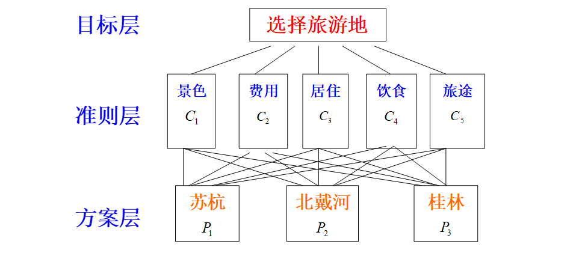

# CH3线性代数方法建模

### overview

线性代数是以向量和矩阵为对象，以实向量空间为背景的一种抽象数学工具，它的应用遍及科学技术和国民经济各个领域。本篇通过基因遗传学、投入产出模型等几个例子阐述以线性代数为主要工具建立数学模型的一般方法和步骤。

## 3.1常染色体基因遗传

常染色体基因遗传中，后代是从每个亲本的基因对中各继承一个基因，形成自己的基因对。

### 模型一 植物基因的分布

植物基因对为AA、Aa、aa三种类型，设:
$x_1(n)$：第n代植物中基因AA所占比例
$x_2(n)$：第n代植物中基因Aa所占比例
$x_3(n)$：第n代植物中基因aa所占比例
$x(n)=(x_1(n),x_2(n),x_3(n))^T,n=0,1,2,...$
显然：$x_1(n)+x_2(n)+x_3(n)=1$
由于==后代是各从父代和母体的基因对中等可能地得到一个基因而形成自己的基因对==，父代母代基因对和子代各基因对之间地转移概率如下表：
|子代v父母>|AA-AA|AA-Aa|AA-aa|Aa-Aa|Aa-aa|aa-aa|
|-|-|-|-|-|-|-|-|-|-|-|-|
|AA|1|$\frac{1}{2}$|0|$\frac{1}{4}$|0|0|
|Aa|0|$\frac{1}{2}$|1|$\frac{1}{2}$|$\frac{1}{2}$|0|
|aa|0|0|0|$\frac{1}{4}$|$\frac{1}{2}$|1|
若使用AA型植物与其他基因植物相结合地方法培育后代，则有：
$$
\small
\begin{cases}
  x_1(n)=x_1(n-1)+\frac{1}{2}x_2(n-1)\\
  x_2(n)=\frac{1}{2}+x_3(n-1)\\
  x_3(n)=0 .................（1）
\end{cases}
$$
令
$$
L=
\begin{pmatrix}
  1&\frac{1}{2}&0\\
  0&\frac{1}{2}&1\\
  0&0&0
\end{pmatrix}
$$
则第n代与第n-1代植物基因型分布关系为：
$x(n)=Lx(n-1),(n=1,2,...) （2）$
由（2）得：
$x(n)=L^nx(0),(n=1,2,...) （3）$
将L对角化，求出L的特征值1、1/2、0对应的特征向量构成矩阵：
$$
P=\begin{pmatrix}
    1&1&1\\
    0&-1&-2\\
    0&0&1
  \end{pmatrix}
$$
再求
$$
P^{-1}=
  \begin{pmatrix}
    1&1&1\\
    0&-1&-2\\
    0&0&1
  \end{pmatrix}
$$
则：
$$
L^n=L
  \begin{pmatrix}
    1&0&0\\
    0&1/2&0\\
    0&0&0
  \end{pmatrix}P^{-1}
=\begin{pmatrix}
  1&1-(\frac{1}{2})^n&1-(\frac{1}{2})^{n-1}\\
  0&(\frac{1}{2})^n&(\frac{1}{2})^{n-1}\\
  0&0&0
\end{pmatrix}\tag{4}
$$
将（4）代入（3）可得：
$$
\small
\begin{cases}
  x_1(n)=x_1(0)+[1-(\frac{1}{2})^n]x_2(0)+[1-(\frac{1}{2})^{n-1}]x_3(0)\\
  x_2(n)=(\frac{1}{2})^nx_2(0)+(\frac{1}{2})^{n-1}x_3(0)\\
  x_3(n)=0
\end{cases}
$$
所以，当$n\rightarrow \infty$时，存在$x_1(n)\rightarrow1,x_2(n)\rightarrow0,x_3(n)\rightarrow0$，也就是说，==培育的植物AA型基因所占的比例在不断增加，极限状态下所有植物的基因都是AA型==。

### 模型二 常染色体遗传疾病

常染色体遗传疾病对应的基因型将人口分成三类。记

- AA型：正常人，
- Aa型：隐性患者，
- aa型：显性患者。

假设在开始时，AA，Aa，aa型基因的人所占比例为$a_0,b_0,c_0$；$x_1(n),x_2(n),x_3(n)$为第n代人口中所占的百分比。

#### *控制结合*

==显性患者（aa）不能生育后代，隐形患者（Aa）必须与正常人（AA）结合才能剩余后代==。
则从n=1开始就有$x_3(n)=0$，即不再有显性患者，而且：
$$
\small
\begin{cases}
  x_1(n)=x_1(n-1)+\frac{1}{2}x_2(n-1)\\
  x_2(n)=\frac{1}{2}x_2(n-1)  (n=1,2,...)
\end{cases}\tag{1}
$$
或：
$$
\begin{pmatrix}
  x_1(n)\\
  x_2(n)
\end{pmatrix}
=\begin{pmatrix}
  1&\frac{1}{2}\\
  0&\frac{1}{2}
\end{pmatrix}
\begin{pmatrix}
  x_1(n-1)\\
  x_2(n-1)
\end{pmatrix}\tag{2}
$$
递推得：
$$
\begin{pmatrix}
  x_1(n)\\
  x_2(n)
\end{pmatrix}
=C^n
\begin{pmatrix}
  a_0\\
  b_0
\end{pmatrix}\tag{3}
$$
由于：
$$
{\begin{pmatrix}
  1&\frac{1}{2}\\
  0&\frac{1}{2}
\end{pmatrix}}^n
=\begin{pmatrix}
  1&1-(\frac{1}{2})^n\\
  0&(\frac{1}{2})^n
\end{pmatrix}\tag{4}
$$
可得：
$$
\small
\begin{cases}
  x_1(n)=a_0+[1-(\frac{1}{2})^n]b_0\\
  x_2(n)=(\frac{1}{2})^nb_0 (n=1,2,...)
\end{cases}\tag{5}
$$
可见在控制结合的方案下，隐形及那个逐渐消失。

#### *自由结合*

三种基因的人任意结合生育后代（假设男女比例为1：1）
记：
$A_1：父代为AA，B_1：母代为AA，C_1：子代为AA$
$A_2：父代为Aa，B_2：母代为Aa，C_2：子代为Aa$
$A_3：父代为aa，B_3：母代为aa，C_3：子代为aa$
记$p(A_iB_j)=p(A_i)p(B_j)=x_i(n-1)x_j(n-1)(i,j=1,2,3)$
则由全概率公式可得：$p(C_k)=x_k(n)=\sum_{i=1}^{3}\sum_{j=1}^{3}p(A_iB_j)p(C_k|A_iB_j) (k=1,2,3)$
代入后可得：
$$
\small
\begin{cases}
  x_1(n)=(x_1(n-1)+\frac{1}{2}x_2(n-1))x_1(n-1)+(x_1(n-1)+\frac{1}{2}x_2(n-1))\frac{1}{2}x_2(n-1)\\
  x_2(n)=(\frac{1}{2}x_2(n-1)+x_3(n-1))x_1(n-1)+\frac{1}{2}(x_1(n-1)+x_2(n-1)+x_3(n-1))x_2(n-1)+(x_1(n-1)+\frac{1}{2}x_2(n-1))x_3(n-1)\\
  x_3(n)=\frac{1}{2}(\frac{1}{2}x_2(n-1)+x_3(n-1))x_2(n-1)+(x_3(n-1)+\frac{1}{2}x_2(n-1))x_3(n-1)
\end{cases}\tag{6}
$$
化简得：
$$
\small
\begin{cases}
  x_1(n)=x_1^2(n-1)+x_1(n-1)x_2(n-1)+\frac{1}{4}x_2^2(n-1)\\
  x_2(n)=x_1(n-1)x_2(n-1)+2x_1(n-1)x_3(n-1)+x_2(n-1)x_3(n-1)+\frac{1}{2}x_2^2(n-1)\\
  x_3(n)=x_3^2(n-1)+x_2(n-1)x_3(n-1)+\frac{1}{4}x_2^2(n-1)
\end{cases}\tag{7}
$$
记$p=a_0+\frac{b_0}{2},q=c_0\frac{b_0}{2}$,从n=1开始递推得：
$$
\small
\begin{cases}
  x_1(1)=a_0^2+a_0b_0+\frac{1}{4}b_0^2=p^2\\
  x_2(1)=a_0b_0+2a_0c_0+b_0c_0+\frac{1}{2}b_0^2=2pq\\
  x_3(1)=c_0^2+b_0c_0+\frac{1}{4}b_0^2=q^2
\end{cases}\tag{8}
$$
$$
\small
\begin{cases}
  x_1(2)=p^2(p^2+2pq+q^2)=p^2\\
  x_2(2)=2pq(p^2+2pq+q^2)=2pq\\
  x_3(2)=q^2(p^2+2pq+q^2)=q^2
\end{cases}\tag{9}
$$
说明以后各代中基因得分布永远是$p^2,2pq,q^2$，==三类人的比例不变==.

## 3.4层次分析法

### 背景

某些问题的一个共同特点是它们都通常涉及到经济、社会、人文等方面的因素。==在作比较、判断、评价、决策时，这些因素的重要性、影响力或者优先程度往往难以量化==，人的主观选择会起着相当重要的作用，这就给用一般的数学方法(机理分析和统计分析)解决问题带来本质上的困难。例如：

- 国家综合实力分析需要考虑到国民收入、军事、科技、社会稳定、外贸等方面的因素
- 资源开发的综合判断需要考虑潜在经济价值、开采费用、风险、需求、战略重要性、交通条件等因素
- 大学生毕业工作选择需要考虑贡献、收入、发展、声誉、关系、位置等因素
- 科技成果的综合评价

*层次分析法(简记AHP)*是一种定性和定量相结合的,系统化,层次化的分析方法，由T.L.Saaty等人在七十年代提出，是一种能有效地处理这样一类问题的实用方法。从处理问题的类型上分类，主要是决策、评价、分析、预测等。

### AHP的基本步骤

#### 1.建立层次结构模型

在深入分析实际问题的基础上,将有关的各个因素按不同属性自上而下地分解成若干层次。==同一层次的诸因素从属于上一层的因素或对上层因素有影响,同时又支配下一层的因素或受下层因素的作用==,最上层为目标层,最下层为方案层,中间可有1个或几个层次,称为准则层。

#### 2.构成对比较矩阵

从层次结构模型的第二层开始，对于从属于上一层每个因素的同一层诸因素，用成对比较法和1-9比较尺度构造成对比较阵，直到最下层。
例如要比较$C_1,C_2,C_3,...,C_n$对上层因素O的影响，每次取两个因素$C_i,C_j$，用$a_{ij}$表示$C_i,C_j$对O的影响之比。所有的比较结果用比较矩阵$A=(a_{ij})_{n\times n},a_{ij}>0,a_{ji}=\frac{1}{a_{ij}}$来表示，这里的$a_{ij}$是相对比较尺度，其含义为：
|尺度$a_{ij}$|含义|
|-|-|
|1|$C_i$对$C_j$的影响==相同==|
|3|$C_i$对$C_j$的影响*稍强*|
|5|$C_i$对$C_j$的影响*强*|
|7|$C_i$对$C_j$的影响*明显地强=*|
|9|$C_i$对$C_j$的影响==绝对地强==|
|2,4,6,8|$C_i$对$C_j$的影响之比在上述两相邻等级之间|

#### 3.计算权向量并作一致向检验

对于承兑比较矩阵A，应满足$a_{ij}\cdot a_{jk}=a_{ik}(i,j,k=1,2,3,...,n)$，则称A为一致性矩阵，有如下性质：

- 1.rank A=1,A的唯一非零特征根为n
- 2.A的任一列向量都是对应于特征根n的特征向量

因此自然应取对应特征根n的，归一化的特征向量（即分量之和为1）表示诸因素$C_1,C_2,C_3,...,C_n$对上层因素O的权重，这个特征向量称为权向量。
一般成对比较矩阵不容易做到完全一致，因为矩阵A的特征根和特征向量连续地依赖于矩阵的元素$a_{ij}$，所以当$a_{ij}$离一致性的要求不远时，A的特征根和特征向量也与一致阵相差不大，Saaty等人建议，如果成对比较阵A不是一致阵，但在不一致的容许范围内，仍可以用对应于A的最大特征根$\lambda$的特征向量（归一化）作为权向量**W**。
要确定A的不一致程度的容许范围，就要进行一致性检验，其步骤为：

- 1.计算一致性指标$CI=\frac{\lambda-n}{n-1}$；
- 2.查下表得出随机一致向指标RI的数值：
  |n|1|2|3|4|5|6|7|8|9|10|11|
  |-|-|-|-|-|-|-|-|-|-|-|-|
  |RI|0|0|0.58|0.90|1.12|1.24|1.32|1.41|1.45|1.49|1.51|
- 3
  - 对$n\ge3$，计算一致性比率$CR=\frac{CI}{RI}$;
  - 对$CR<0.1$，认为A的不一致程度在容许范围内，可以用其特征向量作为权向量，否则就要从小构造对比矩阵。

#### 4.计算组合权向量并做组合一致性检验

由各准则对目标的权向量$W^{(2)}$和各方案对于每个准则的权向量$W_k^{(3)}(k=1,2,...,n)$，计算各方案对目标的权向量$W^{(3)}$，称为组合权向量，计算方法如下：
以$W_k^{(3)}$为列向量构成矩阵$W^{(3)}=[W_1^{(3)},W_2^{(3)},...,W_n^{(3)}]$，则第三次对第一层的组合权向量$W^{(3)}$为$W^{(3)}=W^{(3)}W^{(2)}$。
在层次分析的整个计算过程中，除了对每个成对比较阵进行一致性检验，以判断每个权向量是否可以应用外，还应==对最后结果进行组合一致性检验==，以确定组合权向量是否可以作为最终的决策依据。

## 3.6 CT图像重建

CT，即计算机断层成像技术(Computer Tomography)，亦称计算机辅助断层扫描CAT-Scanner。

### CT原理

拍X光片是将三维对象（立体）显示在二维的胶片或荧光屏上，待检测物体与胶片平行，X射线垂直投射到胶片上，这样，在==深度方向的信息重叠在一起，混淆不清==。另外，由于胶片的密度分辩力低，不能区分软组织的细节，只能区分密度差别大的内脏器官，影响了诊断的效力。CT的创立，解决了这个问题。它不同于传统的X射线，它的**X射线束位于待检测物体的横截面内**，X射线源发射出极细的笔束X射线，在其对面放置一检测器，测量出==X射线源发出的射线的强度$I_0$== ，以及==经过物体衰减后达到检测器的X射线强度$I$==，然后，将X射线源与检测器在观测平面内不断同步改变位置（平移或旋转），得到关于X射线强度$I$的若干组数据（可以是几万组甚至几十万组）。

### 建模

如果物体是均匀的，物体对于X射线的衰减系数为常数。假设强度为$I_0$的射线在物体中行进距离x后衰减至$I_0$，由Beer定理：
$I=I_0e^{-\mu x}或\mu x=ln(\frac{I_0}{I})  （1）$
但是若物体在待测的xy平面内是不均匀的，则$\mu=\mu(x,y)$。此时X射线在某一方向沿某一路径$L_0$的总衰减可以用线积分表示：
$\int_L\mu dl=ln(\frac{I_0}{I})  （2）$
（2）称为**射线投影**。若未指明路径L，即$\int\mu dl$，则称为**投影**，投影式一组谁先按投影的集合。
CT图像重建要做的就是根据一系列$I_0$和$I$来求$\mu=\mu(x,y)$，求出来是一个离散的二元函数，然后数模转换器可以将这个函数转换为图像信号，这个过程就是==投影重建图像==。
投影重建技术的方法包括反投影重建算、滤波重建算法、迭代重建算法，这里介绍迭代重建算法。
将待测物体的截面分成许多边长为$\delta$的小正方形，每个小正方形称为一个像元。设一束宽为$\delta$的射线，平行于像元的边，穿过整个像元。X射线中的光子以一定的速率被像元内的组织吸收，其速率正比于组织的X射线密度（线性衰弱系数）。记第j个像元的X射线密度为$x_j$，定义：
$x_j=ln\frac{进入第j个像元的光子数目}{离开第j个像元的光子数目}=-ln(穿过第j个像元而未被吸收的光子所占百分比)$
如果第i束X射线穿过由有k个像元组成的一行像元，那么第i束X射线经过这行像元未被吸收的百分比=第i束X射线经过待检测物体的截面而未被吸收的百分比。
记：$b_i=ln\frac{第i束射线未经过待检测截面进入检测器的光子数目}{第i束射线经过待测截面进入检测器的光子数目}=-ln(第i束射线经过待检测截面后未被吸收的光子的百分比)$
称为第i束X射线的密度，从而：
$x_1+x_2+...+x_k=b_i （3）$
式中的$b_i$可以测量，而$x_1,x_2,...,x_k$是未知的。
将待测的截面分别成$N=n^2$个像元，其标号由1~N，第i束X射线穿过n个像元组成的一行像元，这些像元记为$j_1,j_2,...,j_n$，则（3）可写为：
$x_{j_1}+x_{j_2}+...+x_{j_n}=b_i （4）$
令
$$
\small a_{ij}=
\begin{cases}
  1,若j=j_1,j_2,...j_n\\
  0,其他\\
\end{cases}
$$
则（4）可写成线性方程组$a_{i1}x_1+a_{i2}x_2+...+a_{iN}x_N=b_i,i=1,2,...,M (5)$
其中M为射线数目，称(5)为第i束X射线的方程，矩阵$A=(a_{ij})_{M\times N}$称为**投影矩阵**。
然而，一束射线并不一定沿平行于像元的方向穿过像元，因而需要对（5）中$a_{ij}$的值进行修正，常用如下方法：

- (1)像元中心法：
  $$
  \small a_{ij}=
  \begin{cases}
    1,若第i束射线经过第j个像元的中心\\
    0,其他
  \end{cases}\tag{6}
  $$
- (2)中心线法：$a_{ij}=\frac{第i束射线的中心线位于第j个像元内的长度}{第j个像元内的长度}=\frac{1}{\delta} （7）$
- (3)面积法：$a_{ij}=\frac{第i束射线位于第j个像元内的面积}{第i束射线若平行于像元变穿过第j个像元时位于第j个像元内的面积} （8）$

假设共有M束射线，N个像元，利用三种方法中的一种选择$a_{ij}$，可以得到一个含有N个未知数，M个方程的线性方程组：
$\sum_{j=1}^{N}a_{ij}x_j=b_i,i=1,2,...,M （9）$
实际的CT设备中，$N=80\times80;320\times320$d等，M=28800；184300等。
（9）可能有解，可能无解；有解时也可能由无穷多组解。从客观实际的角度出发，（9）应该有解。由于模型是由实际问题经过若干近似抽象而来的，数据又是测量得到的，误差不可避免，因此可能出现无解的情况。故把（9）写成：
$Ax+e=b （10）$
其中，e为误差向量。
由于矩阵A的元素很多，又有许多元素为零，用消元法来解很费时，在CT中用迭代法求解。它的思想是：先建立一个判据，即接受的标准，选择一个解的初始值，若它符合判据，则接受为解，若达不到要求，则按一定的方法对原值加以修正，通过不断的迭代，直到可以接受为解为止。