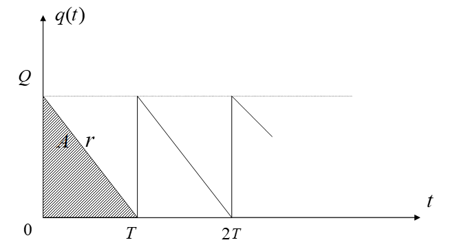
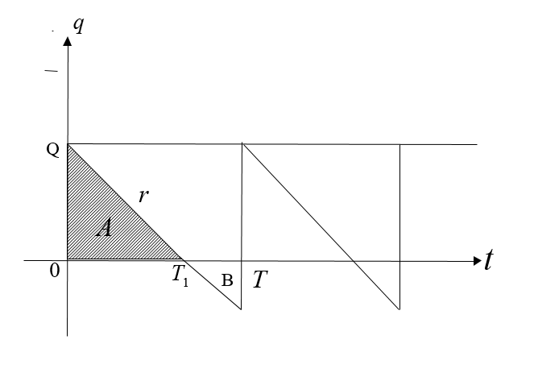
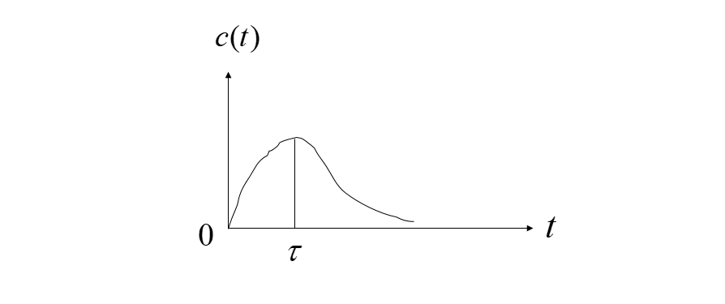
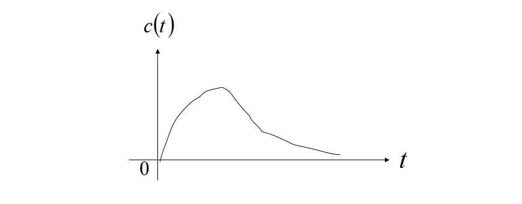

# 第二章：微积分方法建模

### overview:

涉及连续的变量，可以用微积分求解，求得解析式便于下一步分析。有些离散的变量也可以演变成连续变量进行求解。当我们描述实际对象的某些特性随时间（或空间）而演变的过程，分析它的变化规律，预测它的未来性态时，通常要==建立对象的动态模型==。建模时首先要根据建模目的和对问题的具体分析作出*简化假设*，然后按照对象内在的或可以类比的其它对象的规律列出微分方程，求出方程的解并将结果翻译回实际对象，就可以进行描述、分析或预测了。

## 2.1飞机降落曲线

飞机降落时，其曲线是一条三次抛物线，如下图：

水平速度为常数u，出于安全考虑，飞机的垂直加速度不得超过g/10，已知飞行高度h，要求在坐标原点降落，求开始下降点$x_0$允许的最小值。

### 求曲线解析式

设飞机降落曲线为：

$y = ax^3+bx^2+cx+d$

依据假设可知：
$y(0)=0,y(x_0)=h,y'(0)=0,y'(x_0)=0$，带入上式可得：

$$
\small
\begin{cases}
    y(0)=d=0,\\
    y'(0)=c=0,\\
    y(x_0)=ax^3+bx^2+cx+d=h,\\
    y'(x_0)=3ax^2+2bx_0+c=0x=0\\
\end{cases}
$$
所以:
$a = -\frac{2h}{{x_0}^3},b=\frac{3h}{{x_0}^2},c=0,d=0$

其曲线为：
$y=-\frac{h}{{x_0}^2}(\frac{2}{x_0}x^3-3x^2)$

### 求最佳着陆点

飞机垂直速度是y关于时间t的导数：
$\frac{dy}{dt}=-\frac{h}{{x_0}^2}(\frac{6}{x_0}x^2-6x)\frac{dx}{dt}$

其中，$\frac{dx}{dt}$是飞机水平速度，所以$\frac{dx}{dt}=u$，则：
$\frac{dy}{dt}=-\frac{6hu}{{x_0}^2}(\frac{x^2}{x_0}-x)$

垂直加速度为：$\frac{d^2y}{dt^2}=-\frac{6hu}{{x_0}^2}(\frac{2x}{x_0}-1)\frac{dx}{dt}=-\frac{6hu^2}{x_0^2}(\frac{2x}{x_0}-1)$

设$a(x)=\frac{d^2y}{dt^2}$,则：

$|a(x)|=\frac{6hu^2}{{x_0}^2}|\frac{2x}{x_0}-1|,x\in[0,x_0]$

所以，垂直加速度最大值为：

$max|a(x)|=\frac{6hu^2}{{x_0}^2},x\in[0,x_0]$

由于题目限制：$max|a(x)|\leq\frac{g}{10}$，所以：

$x_0\geq u\sqrt{\frac{60h}{g}}$，此为$x_0$的最小值。

## 2.2经济增长模型

发展经济、增加生产有两个重要因素，一是==增加投资==（扩大厂房、购买设备、技术革新等），二是==增加劳动力==。恰当调节投资增长和劳动力增长的关系，*==使增加的产量不致被劳动力的增长抵消==，劳动生产率才能不断提高*，从而真正起到发展经济的作用。为此，需要==分析产量、劳动力和投资之间变化规律==，从而保证经济正常发展。
假设：
$Q(t)$——地区、部门、企业在某时间t的产量
$L(t)$——地区、部门、企业在某时间t的劳动力
$K(t)$——地区、部门、企业在某时间t的资金
$Z(t)$——每个劳动力在某时间t所占有的产量（劳动力生产率）

### 道格拉斯（Douglas）生产函数

由于我们只关心产量、劳动力、投资的相对增长，而不是绝对量，所以定义：
产量指数：$i_Q(t) = \frac{Q(t)}{Q(0)}$，劳动力指数：$i_L(t) = \frac{L(t)}{L(0)}$，投资指数：$i_K(t) = \frac{K(t)}{K(0)}$ （1）
令：$\xi(t)=\ln\frac{i_L(t)}{i_K(t)}$,$\psi(t)=\ln\frac{i_Q(t)}{i_K(t)}$ （2）
根据统计数据,散点$(\xi,\psi)$在直角坐标系下的图像大致为：

由图可知，大多数的点处在一条经过原点的直线附近，故$\xi$和$\psi$有如下关系：

$\psi=\gamma\xi  (0<\gamma<1)$ （3）
带入上式可得：
$i_Q(t)={i_L}^\gamma(t){i_K}^{1-\gamma}(t)$ （4）
记$a=Q(0)L^{-\gamma}(0)K^{1-\gamma}(0)$,则由（1）和（4）可知:
$Q(t)=aL^\gamma(t)K^{1-\gamma}(t)$ （5）
式（5）就是经济学中著名的Douglas生产函数，它表明产量余劳动力、投资之间的关系，即：
$\frac{\dot{Q}}{Q}=\gamma\frac{\dot{L}}{L}+(1-\gamma)\frac{\dot{K}}{K}$ （6）
其中$\dot{Q}$、$\dot{L}$、$\dot{K}$表示Q、L、K关于t的导数。
这个函数表明，相对增长量，$\frac{\dot{Q}}{Q}$、$\frac{\dot{L}}{L}$、$\frac{\dot{K}}{K}$之间呈线性关系，当$\gamma\rightarrow1$时产量增长主要依靠劳动力增长，当$\gamma\rightarrow0$时产量增长主要依靠投资。亦称$\gamma$为==产量对劳动力的弹性系数==

### 劳动生产率增长条件

定义劳动生产率$Z(t)=\frac{Q(t)}{L(t)}$，则$\frac{\dot{Z}}{Z}=\frac{\dot{Q}}{Q}-\frac{\dot{L}}{L}$,将（6）代入$Z(t)$可得：
$\frac{\dot{Z}}{Z}=(1-\gamma)(\frac{\dot{K}}{K}-\frac{\dot{L}}{L})$ （7）
由（7）可见，只要$\frac{\dot{K}}{K}>\frac{\dot{L}}{L}$就能保证$\frac{\dot{Z}}{Z}>0$,即==劳动生产率的提高需要由投资的相对增长大于劳动力的相对增长为前提条件==。

## 2.3存贮模型

原料、商品的存贮问题，存的太多，存贮费用过高；存的太少，无法及时满足需求。目的：==制定最有存贮策略==，即：多长时间顶一次货，每次顶多少货，才能使总费用最小。

### 模型一

#### 模型假设

- 每次订货费用为$C_1$，每天每吨货物贮存费用为$C_2$(已知)
- 每天货物的需求量r吨为已知
- 订货周期为T天，每次订货Q吨，当贮存量降到0时订货立即到达。

#### 模型建立

订货周期、订货量余每天的需求量存在关系：
$Q=rT$
订货以后贮存量$q(t)$均匀地下降，即$q(t)=Q-rt$,如下图：

则一个订货周期的费用：
$$
\small
\begin{cases}
    订货费:C_1,\\
    存贮费:\int_{0}^{T}q(t)\,dt=\frac{1}{2}C_2QT=\frac{1}{2}C_2rT^2\\
\end{cases}
$$
即：$C(T)=C_1+\frac{1}{2}C_2rT^2$
则一个订货周期每天的费用为：$\overline{C}(T)=\frac{C_1}{T}+\frac{1}{2}C_2rT$

#### 模型求解

令$\frac{d\overline{C}}{dT}=0$,可求得：$T=\sqrt{\frac{2c_1}{RC_2}}$
进而：$Q=\sqrt{\frac{2C_1r}{C_2}}$
此模型称为==经济订货批量公式==，简称EOQ公式

### 模型二 允许缺货的存贮模型

#### 模型假设

- 每次订货费用为$C_1$,每天每吨货物贮存费用$C_2$(已知)
- 每天的货物需求量r吨（已知）
- 订货周期为T天，订货量Q，允许缺货，每天每吨货物缺货费$C_3$（已知）

#### 模型建立

缺货时的存储量q视为负值，则$q(t)$的图像如下，货物在$t=T_1$时用完，于时$Q=rT_1$

则一个订货周期内总费用为：
$$
\small
\begin{cases}
    订货费:C_1,\\
    存贮费:\int_{0}^{T_1}q(t)\,dt=\frac{1}{2}C_2QT_1=\frac{1}{2}C_2\frac{Q^2}{r},\\
    缺货费:\int_{T_1}^{T}|q(t)|\,dt=\frac{C_3}{2}r(T-T_1)^2=\frac{C_3}{2r}(rT-Q)^2
\end{cases}
$$
即：$C(T,Q)=C_1+\frac{1}{2}C_2Q^2\frac{1}{r}+\frac{1}{2r}C_3(rT-Q)^2$
则平均每天的费用为：
$\overline{C}(T,Q)=\frac{C(T,Q)}{T}=\frac{C_1}{T}+\frac{C_2Q^2}{2rT}+\frac{C_3(rT-Q)^2}{2rT}$

#### 模型求解

$$
\small
\begin{cases}
    \frac{\partial\overline{C}}{\partial T}=0\\
    \frac{\partial\overline{C}}{\partial Q}=0
\end{cases}
$$
求出T、Q的最优解，分别记为$T'、Q'$
$T'=\sqrt{\frac{2C_1}{rC_2}\frac{C_2+C_3}{C_3}},Q'=\sqrt{\frac{2C_1r}{C_2}\frac{C_3}{C_2+C_3}}$

#### 分析

令$\mu=\sqrt{\frac{C_2+C_3}{C_3}}$,与模型一相比，有：
$T'=\mu T,Q'=\frac{Q}{\mu}$
显然，T' > T,Q' < Q,即在允许缺货时应增大订货周期，减少订货批次；当缺货非$C_3$相对于存贮费$C_2$而言越大时，$\mu$越小，T'和Q'越接近T和Q。

## 2.4城市人口统计模型

### 模型一（估算城市现有人口）

城市人口密度常用$P(r)=\frac{b}{r^2+a}$或者$P(r)=ae^{-br}(a,b>0)$来近似表示，其中r是距城中心的距离。则计算距离市中心C区域内的人口数N可以这样：从城市中心画一条射线，把这条线上从0到C之间n等分，每小区间长度为$\Delta r$，每小区间确定一个圆环，第j个圆环面积为从城市中心为：
$\pi{r_j}^2-\pi{r_{j-1}}^2=\pi{r_j}^2-\pi(r_j-\Delta r)^2=2\pi r_j\Delta r-\pi(\Delta r)^2\approx2\pi r_j \Delta r$  $(\Delta r很小)$

第j个圆环上的人口数近似为$P(r_j)2\pi r_j \Delta r$,所以：

$N\approx \sum_{j=1}^{n}P(r_j) 2\pi r_j \Delta r$

令$n\rightarrow\infty$时，

$N=\int_{0}^{C}P(r)2\pi r\,dr$

### 模型二（预测城市未来人口）

P(t)表示t时刻的城市人口数量，人口变化手下面规则的影响：

- t时刻的净增长人口以每年r(t)的比率增加
- 在一段世界内，由于自然死亡和人口迁移，$T_1$时刻的人口数$P(T_1)$的一部分在$T_2$时刻仍然存在，用$h(T_2-T_1)P(T_1)$来表示，这里$0<h(T_2-T_1)<1$，$T_2-T_1$是这段时间的长度。

把(0,T]时间划分为n等分，每个小区间长度为$\Delta t$。
假设初始时刻人口为P(0)，到时刻T将只剩h(T)P(0)。当$\Delta t$很小的时候，从$t_{j-1}$到$t_j$，净增长的人口比率近似为常数$r(t_j)$。这段时间净增的人口数近似为$r(t_j)\Delta t$,在$t_j$时刻的人口到T时刻只剩$h(T-t_j)r(t_j)\Delta t$。所以在T时刻的总人口数近似为：

$P(T)\approx h(T)P(0)+\sum_{j=1}^{n}h(T-t_j)r(t_j)\Delta t$

令$n\rightarrow\infty$，得：

$P(T)=h(T)P(0)+\int_{0}^{T}h(T-t)r(t)\,dt$

## 2.7古生物年代确定

主要思路：$C^{14}$的半衰期为5568年，根据$C^{14}$的蜕变减少量的变化来判断生物的死亡时间。

### 模型假设

- 地球周围大气的$C^{14}$可以认为不变，现代生物和古代生物体内的$C^{14}$蜕变速度一致。
- 由原子物理学，$C^{14}$的蜕变速度与该时刻的$C^{14}$含量成正比。

### 模型建立

记，$x(t)$代表t时刻生物体内$C^{14}$的含量。由假设可知：$\frac{dx}{dt}=-kx,k>0 （1）$
（1）的通解为$x(t)=Ce^{-kt}$，设生物死亡时间为$t_0$，代入可知，$C=x_0$，于时：
$x(t)=x_0e^{-kt} (2)$
记$C^{14}$的半衰期为T，则有：
$x(T)=\frac{x_0}{2} （3）$
将（3）代入（2）可得$k=\frac{ln2}{T}$，故可解得：
$t=\frac{T}{ln2}ln\frac{x_0}{x(t)} （4）$
由于$x_0和x(t)$难以测量，故使用另一种方法求t：
对（2）两边求导：
$x'(t)=-x_0ke^{-kt}=-kx(t)$
$x'(0)=-kx(0)=-kx_0$
两式相除，可得：$\frac{x'(t)}{x'(0)}=\frac{x_0}{x(t)}$,代入(4)可得：
$t=\frac{T}{ln2}ln\frac{x'(0)}{x'(t)}$
所以只需要测出标本$C^14$的平均蜕变速度（单位：次/分钟），即$x'(t)$，和现在的$C^14$的蜕变速度$x'(0)$，即可求出t。

## 2.8预测人口的增长

### 模型一：Malthhus指数增长模型

#### 模型假设
1.某国/地区再t时刻的人口数x(t)为连续可微函数。
2.人口的增长率r是常数，即，单位时间人口的增长量与当时的人口成正比

#### 模型建立
记$x_0$为初始时刻的人口，即$x(0)=x_0$
则从$t$到$t+\Delta t$内人口的增长量为：
$x(t+\Delta t)-x(t)=rx(t)\Delta t$
可导出下面的微分方程：
$$
\small
\begin{cases}
    \frac{dx}{dt}=rx\\
    x(0)=x_0
\end{cases}
$$
解得：$x(t)=x_0e^{rt}  ,r>0$

### 模型二：Logistic阻滞增长模型

#### 模型假设

1.同模型一
2.==当人口增加到一定数量后，增长率随着人口的继续增长而逐渐减少==，且r(x)为x的线性函数$r(x)=r-sx$，其中r为x=0时的增长率，成为固有增长率。
3.自然资源和环境条件所能容纳的最大人口数量为$x_m$，称作最大人口容量

#### 模型建立

当$x=x_m$时，增长率为0，即$r(x_m)=0$,进而：$S=\frac{r}{x_m}$,所以：$r(x)=r(1-\frac{x}{x_m})$
其中的$r,x_m$是根据人口统计数据确定的常数，$x_m$常由经验决定(==模型缺点：$x_m$不易轻易地得到==)。
模仿模型一可得：
$$
\small
\begin{cases}
    \frac{dx}{dt}=r(1-\frac{x}{x_m})x\\
    x(0)=x_0
\end{cases}
$$
解得：$x(t)=\frac{x_m}{1+(\frac{x_m}{x_0})e^{-rt}}$

## 2.9药物在体内地分布与排除

### 模型背景
药物进入机体后，在随血液输送到各器官和组织的过程中，不断地被吸收、分布、代谢，最终排出体外。药物在血液中的浓度($\mu g/mv$)称==血药浓度==。血药浓度的大小直接影响到药物的疗效，浓度太低不能达到预期的治疗效果，浓度太高又可能导致中毒、副作用太强或造成浪费。
因此，==研究药物在体内吸收、分布和排除的动态过程==，对于新药研制时剂量的确定、给药方案设计等药理学和临床医学的发展具有重要的指导意义和实用价值。
为了研究目的，==将一个机体划分成若干个房室，每个房室是机体的一部分==，比如中心室和周边室。在一个房室内药物呈均匀分布，而在不同的房室之间按一定规律进行转移。

### 模型假设
1.药物进入机体后，全部进入中心室（血液较丰富的心、肺、肾等器官和组织），中心室的容积在给药过程中保持不变；
2.药物从中心室排出体外，与排除的数量相比，药物的吸收可以忽略；
3.药物排除的速率与中心室的血药浓度成正比。

### 模型建立
$f_0(t)：给药速度$
$c(t)：中心室血药浓度$
$x(t)：中心室药量$
$V：中心室容积$
$k：排除速率系数$

### 求各种给药方式下血药浓度变化情况

上述变量有如下关系:
$\dot{x}=f_0(t)-kx$
即$\dot{x}+kx=f_0(x)$
又$x(t)=Vc(t)$
可得：$\dot{c}(t)+kc(t)=\frac{f_0(t)}{V} （1）$

- 1.快速静脉注射(指数模型)
  给药量为D，则初始条件$c(0)=\frac{D}{V},f_0(t)=0$
  解得：$c(t)=\frac{D}{V}e^{-kt} （2）$
- 2.恒速静脉注射
  设持续时间为$\tau$,注射速率为$k_0$，则有：
  当$(x\le t\le\tau)$时，$f_0(t)=k_0$,初始条件为c(0)=0,
  当$(t\ge\tau)$时，$f_0(t)=0$,初始条件$c(\tau)=\frac{k_0}{Vk}(1-e^{-k\tau})$,所以（1）的解为：
    $$
    \small c(t)=
    \begin{cases}
        \frac{k_0}{Vk}(1-e^{-kt}) ,0\le t\le\tau \\
        \frac{k_0}{Vk}(1-e^{-k\tau})e^{-k(t-\tau)},t\ge\tau （3）
    \end{cases}
    $$
  
- 3.口服或肌肉注射
  在药物输入中心室之前先有一个将药物吸入血液的过程，可以看作有一个吸收室，药物由吸收室进入中心室，药物由吸收室进入中心室额转移速率系数记为$k_1$，给药量D，吸收室药量$x_0(t)$。则有：
  
  $$
  \small
  \begin{cases}
      \dot{x_0}=-k_1x_0\\
      x_0(t)=D
  \end{cases}
  $$
  上式可推出：$x_0(t)=De^{-k_1t}$
  于时$f_0(t)=k_1De^{-k_1t}$初始条件c(0)=0,（1）的解为：
  $c(t)=\frac{k_1D}{V(k_1-k)}(e^{-kt}-e^{-k_1t}) , k_1>k （4）$
  

## 2.10导弹跟踪

### 背景

在发射导弹时刻（t=0），导弹位于坐标原点(0,0)，飞机位于(a,b)，飞机研平行于x轴的方向以常速$v_0$飞行。导弹在时刻t的位置为点(x,y)，其速度为常值$v_1$，导弹在飞行过程中，按照制导系统时钟指向飞机。请确定导弹的飞行轨迹以及击中飞机所需的时间T。

### 模型建立与求解

首先建立导弹的运动方程。导弹飞行曲线在点M(x,y)处的切线方程为：
$Y-y=\frac{dy}{dx}(X-x)=\frac{\frac{dy}{dt}}{\frac{dx}{dt}}(X-x)$
其中(x,y)为切线上动点的坐标。由于点$A(x_A,b)$应位于切线上，且$x_A=a+v_0t$,所以：
$b-y=\frac{\frac{dy}{dt}}{\frac{dx}{dt}}(a+v_0t-x)$
从而，导弹的飞行轨迹为：
$$
\small
\begin{cases}
  \frac{dx}{dt}(b-y)=\frac{dy}{dt}(a+v_0-x) （1）\\
  (\frac{dx}{dt})^2+(\frac{dy}{dt})^2=v_1^2 （2）
\end{cases}
$$
由（1）可得：$\frac{dx}{dy}(b-y)=a+v_0-x$
两边对t求导，得：$\frac{d^2x}{d^2y}\frac{dy}{dt}(b-y)-\frac{dx}{dy}\frac{dy}{dt}=v_0-\frac{dx}{dt}$
即：$\frac{d^2x}{d^2y}\frac{dy}{dt}(b-y)=v_0 （3）$
由（2）得：$(\frac{dy}{dt})^2[1+(\frac{\frac{dx}{dt}}{\frac{dy}{dt}})^2]=v_1^2$
即：$\frac{dy}{dt}=\frac{v_1}{[1+(\frac{dx}{dy})^2]^{\frac{1}{2}}}$
代入（3）可得导弹得运动方程：
$\frac{d^2x}{d^2y}(b-y)=\lambda[1+(\frac{dx}{dy})^2]^{\frac{1}{2}} （4）$
其中，$\lambda=\frac{v_0}{v_1}$，
又$x(0)=0,x(b)=a+v_0T$（在T时刻击中目标） （5）
接下来求（4）满足（5）的解：
设$p=\frac{dx}{dy}$，则$\frac{dp}{dy}=\frac{d^2x}{dy^2}$，
（4）可化为：$\frac{dp}{dy}(b-y)=\lambda(1+p^2)^{\frac{1}{2}} （6）$
$ln[p+(1+p^2)^{\frac{1}{2}}]=-\lambda ln(b-y)+c_1 （7）$
（6）的初始条件为$p(0)=\frac{a}{b}$，令$c_1=ln(kb^{\lambda})$，则：
$ln(p+\sqrt{1+p^2})=ln(b-y)^{-\lambda}+ln(kb^\lambda)=ln[\frac{kb^\lambda}{(b-y)^\lambda}]$
$p+\sqrt{1+p^2}=\frac{kb^\lambda}{(b-y)^\lambda}$
于时可以得到降阶方程：
$\frac{dx}{dy}=\frac{1}{2}[\frac{kb^\lambda}{(b-y)^\lambda}-\frac{(b-y)^\lambda}{kb^\lambda}]$
其通解为：
$x=\frac{1}{2}[\frac{kb^\lambda}{(\lambda-1)(b-y)^{(\lambda-1)}}+\frac{(b-y)^{\lambda+1}}{(\lambda+1)kb^\lambda}]+c （8）$
根据初始条件x(0)=0,可得：
$c=b[(1+k^2)\lambda+k^2-1]/2k(1-\lambda^2)$
所以导弹飞行轨迹方程为：$x=\frac{1}{2}[\frac{kb^\lambda}{(\lambda-1)(b-y)^{(\lambda-1)}}+\frac{(b-y)^{\lambda+1}}{(\lambda+1)kb^\lambda}]+b[(1+k^2)\lambda+k^2-1]/2k(1-\lambda^2)$
又由$x(b)=a+v_0T$得到导弹集中目标的时间为：
$T=\frac{c-a}{v_0}=\frac{\sqrt{a^2+b^2}-a\lambda}{v_1(1-\lambda^2)} （10）$

## 2.11食饵-捕食者系统

一个包含两个群体的系统，其中一个群体紧密地依赖于另一个群体，成为食饵-捕食者系统。假设：x(t):t时刻食饵的数量；y(t):t时刻捕食者的数量。
如果各自独立生活，则：
$$
\small
\begin{cases}
  \frac{dx}{dt}=\lambda x\\
  \frac{dy}{dt}=-\mu y (\lambda,\mu>0)
\end{cases}
$$
如今两者生活在一起，则有：
$$
\small
\begin{cases}
  \frac{dx}{dt}=(\lambda-\alpha y)x	（1）\\
  \frac{dy}{dt}=-(\mu-\beta x)y	（2）(\alpha,\beta>0)
\end{cases}
$$
上式称为Volterra-Lotka方程，初始条件为$x(0)=x_0,y(0)=y_0$(1)/(2)可得：
$\frac{dy}{dx}=\frac{(\beta x-\mu)y}{(\lambda-\alpha y)x}$
可得通解：
$-\alpha y-\beta x+\lambda lny+\mu lnx=lnc$或$\frac{y^\lambda}{e^{\alpha y}}\frac{x^\mu}{e^{\beta x}}=c$
将初始条件代入，可得特解，是xoy面上的一条闭轨线

当食饵较多时，捕食者增多因而食饵必定减少，使得捕食者也随之减少，从而食饵又会增多。==两者的数量如此起伏，周而复始，维持着生态平衡==。

## 2.12传染病模型

### 背景

建立传染病模型的目的是描述传染过程、分析受感染人数的变化规律、预报高潮来到的时间。
为了简单起见，假设传播期间内所观察地区人数N不变，不计生死迁移，时间以天为单位。

### 模型一 SI模型

#### 模型假设

- 1.人群分为健康者和病人，在t时刻这两类人所占比例分别为s(t),i(t)，即s(t)+i(t)=1;
- 2.平均每个病人每天接触人数是常数$\lambda$，即每个病人平均每天使得$\lambda s(t)$个健康者受感染变成病人，$\lambda$称为==日接触率==。

#### 模型建立

根据模型假设2，在T时刻，每个病人每天可以使得$\lambda s(t)$个健康者变成病人，病人人属为Ni(t)，故每天新增$\lambda Ns(t)i(t)$个患者，即：
$N\frac{di}{dt}=\lambda Nsi$，假设t=0时患者比例$i_0$，可得模型：
$$
\small
\begin{cases}
  \frac{di}{dt}=\lambda i(1-i)   （1）\\
  i(0)=i_0
\end{cases}
$$
式（1）的解为：$i(t)=\frac{1}{1+(\frac{1}{t_0}e^{-\lambda t})}  （2）$

#### 模型解释

- 1.当$i=\frac{1}{2}$时，$\frac{di}{dt}$达到最大值，此时$t=t_m=\lambda^{-1}ln(\frac{1}{i_0}-1)$，也就是说，高潮到来时，$\lambda$越大，则$t_m$越小。
- 2.当$t\rightarrow\infty$时，$i\rightarrow 1$此时所有的人都被感染，因为SI模型没有考虑治愈病人。

### 模型二 SIS模型

在SI模型的基础上引入治愈，对SI模型进行修正。

#### 模型假设

- 1.同SI模型假设1
- 2.同SI模型假设2
- 3.病人每天被治愈的占病人总数的比例为$\mu$，称作日治愈率。

#### 模型修正

SI模型可修正为，t时刻每天有$Ni\mu$的病人转变为健康。
$$
\small
\begin{cases}
  \frac{di}{dt}=\lambda i(1-i)-\mu i  （3）\\
  i(0)=i_0
\end{cases}
$$
（3）的解为：
$$
\small i(t)=
\begin{cases}
  [\frac{\lambda}{\lambda-\mu}+(\frac{1}{i_0}-\frac{\lambda}{\lambda-\mu})e^{-(\lambda-\mu)t}]^{-1},\lambda\not ={\mu}\\
  (\lambda t+\frac{1}{i_0})^{-1},\lambda=\mu  （4）
\end{cases}
$$
由（3）可以计算出使得$\frac{di}{dt}$达到最大值的高潮时刻$t_m$（$\frac{di}{dt}$的最大值$(\frac{di}{dt})_m$在$i=\frac{\lambda-\mu}{2\lambda}$时达到）
记$a=\frac{\lambda}{\mu}$，可知：
$$
\small i(\infty)=
\begin{cases}
  1-\frac{1}{a},a>1\\
  0,a\le 1
\end{cases}
$$

### SIR模型

#### 模型假设

- 1.人群分为健康者、病人、移出者（病愈免疫者），三类人在t时刻在总人数N中占比例分别为s(t)、i(t)、r(t)，即s(t)+i(t)+r(t)=1
- 2.病人日接触率为$\lambda$，日治愈率为$\mu$，传染期间接触数$\sigma=\frac{\lambda}{\mu}$

#### 模型建立

i(t)随t的变化规律同模型二，对于r(t)：
$N\frac{dr}{dt}=\mu Ni,且\frac{ds}{dt}+\frac{di}{dt}+\frac{dr}{dt}=0$
于时可得模型：
$$
\small
\begin{cases}
  \frac{ds}{dt}=-\lambda si\\
  \frac{di}{dt}=\lambda si-\mu i  （5）\\
  s(0)=s_0,i(0)=i_0
\end{cases}
$$
从（5）中消去dt，结合$\sigma$的实际意义，可得：
$$
\small
\begin{cases}
  \frac{di}{ds}=\frac{1}{\sigma s}-1 （6）\\
  i|_{s=s_0}=i_0
\end{cases}
$$
（6）的解为：
$i=(s_0+i_0)-s+\frac{1}{\sigma}ln\frac{s}{s_0} （7）$
根据（5）（7）以及图像可分析s(t),i(t),r(t)的变化规律：
- 1.无论$s_0,i_0$为多少，$i_\infty=0$，即病人终将消失。
- 2.最终未被感染的健康者比例$s_\infty$时方程$s_0+i_0-s_\infty+\frac{1}{\sigma}ln\frac{s_\infty}{s_0}=0 （8）$在$(0,\frac{1}{\sigma})$内的单根。
- 3.若$s_0>\frac{1}{\sigma}$，则当$s=\frac{1}{\sigma}$时，i(t)达到最大值$i_m=s_0+i_0-\frac{1}{\sigma}(1+ln\sigma s_0)$，i(t)先增后减至0.
- 4.若$s_0\le\frac{1}{\sigma}$，则$i(t)\rightarrow0,s(t)\rightarrow s_\infty$。

### 模型解释

- 1.$\frac{1}{\sigma}$是一个阈值，当$s_0>\frac{1}{\sigma}$时传染病会蔓延，$s_0\le\frac{1}{\sigma}$时就不会蔓延
- 2.$\sigma=\frac{\lambda}{\mu}$表示$\lambda$越小，$\mu$越大，$\sigma$也越小，从而越有利。

# CH3线性代数方法建模

### overview

线性代数是以向量和矩阵为对象，以实向量空间为背景的一种抽象数学工具，它的应用遍及科学技术和国民经济各个领域。本篇通过基因遗传学、投入产出模型等几个例子阐述以线性代数为主要工具建立数学模型的一般方法和步骤。

## 3.1常染色体基因遗传

常染色体基因遗传中，后代是从每个亲本的基因对中各继承一个基因，形成自己的基因对。

### 模型一 植物基因的分布

植物基因对为AA、Aa、aa三种类型，设:
$x_1(n)$：第n代植物中基因AA所占比例
$x_2(n)$：第n代植物中基因Aa所占比例
$x_3(n)$：第n代植物中基因aa所占比例
$x(n)=(x_1(n),x_2(n),x_3(n))^T,n=0,1,2,...$
显然：$x_1(n)+x_2(n)+x_3(n)=1$
由于==后代是各从父代和母体的基因对中等可能地得到一个基因而形成自己的基因对==，父代母代基因对和子代各基因对之间地转移概率如下表：
|子代v父母>|AA-AA|AA-Aa|AA-aa|Aa-Aa|Aa-aa|aa-aa|
|-|-|-|-|-|-|-|-|-|-|-|-|
|AA|1|$\frac{1}{2}$|0|$\frac{1}{4}$|0|0|
|Aa|0|$\frac{1}{2}$|1|$\frac{1}{2}$|$\frac{1}{2}$|0|
|aa|0|0|0|$\frac{1}{4}$|$\frac{1}{2}$|1|
若使用AA型植物与其他基因植物相结合地方法培育后代，则有：
$$
\small
\begin{cases}
  x_1(n)=x_1(n-1)+\frac{1}{2}x_2(n-1)\\
  x_2(n)=\frac{1}{2}+x_3(n-1)\\
  x_3(n)=0 .................（1）
\end{cases}
$$
令
$$
L=
\begin{pmatrix}
  1&\frac{1}{2}&0\\
  0&\frac{1}{2}&1\\
  0&0&0
\end{pmatrix}
$$
则第n代与第n-1代植物基因型分布关系为：
$x(n)=Lx(n-1),(n=1,2,...) （2）$
由（2）得：
$x(n)=L^nx(0),(n=1,2,...) （3）$
将L对角化，求出L的特征值1、1/2、0对应的特征向量构成矩阵：
$$
P=\begin{pmatrix}
    1&1&1\\
    0&-1&-2\\
    0&0&1
  \end{pmatrix}
$$
再求
$$
P^{-1}=
  \begin{pmatrix}
    1&1&1\\
    0&-1&-2\\
    0&0&1
  \end{pmatrix}
$$
则：
$$
L^n=L
  \begin{pmatrix}
    1&0&0\\
    0&1/2&0\\
    0&0&0
  \end{pmatrix}P^{-1}
=\begin{pmatrix}
  1&1-(\frac{1}{2})^n&1-(\frac{1}{2})^{n-1}\\
  0&(\frac{1}{2})^n&(\frac{1}{2})^{n-1}\\
  0&0&0
\end{pmatrix}\tag{4}
$$
将（4）代入（3）可得：
$$
\small
\begin{cases}
  x_1(n)=x_1(0)+[1-(\frac{1}{2})^n]x_2(0)+[1-(\frac{1}{2})^{n-1}]x_3(0)\\
  x_2(n)=(\frac{1}{2})^nx_2(0)+(\frac{1}{2})^{n-1}x_3(0)\\
  x_3(n)=0
\end{cases}
$$
所以，当$n\rightarrow \infty$时，存在$x_1(n)\rightarrow1,x_2(n)\rightarrow0,x_3(n)\rightarrow0$，也就是说，==培育的植物AA型基因所占的比例在不断增加，极限状态下所有植物的基因都是AA型==。

### 模型二 常染色体遗传疾病

常染色体遗传疾病对应的基因型将人口分成三类。记

- AA型：正常人，
- Aa型：隐性患者，
- aa型：显性患者。

假设在开始时，AA，Aa，aa型基因的人所占比例为$a_0,b_0,c_0$；$x_1(n),x_2(n),x_3(n)$为第n代人口中所占的百分比。

#### *控制结合*

==显性患者（aa）不能生育后代，隐形患者（Aa）必须与正常人（AA）结合才能剩余后代==。
则从n=1开始就有$x_3(n)=0$，即不再有显性患者，而且：
$$
\small
\begin{cases}
  x_1(n)=x_1(n-1)+\frac{1}{2}x_2(n-1)\\
  x_2(n)=\frac{1}{2}x_2(n-1)  (n=1,2,...)
\end{cases}\tag{1}
$$
或：
$$
\begin{pmatrix}
  x_1(n)\\
  x_2(n)
\end{pmatrix}
=\begin{pmatrix}
  1&\frac{1}{2}\\
  0&\frac{1}{2}
\end{pmatrix}
\begin{pmatrix}
  x_1(n-1)\\
  x_2(n-1)
\end{pmatrix}\tag{2}
$$
递推得：
$$
\begin{pmatrix}
  x_1(n)\\
  x_2(n)
\end{pmatrix}
=C^n
\begin{pmatrix}
  a_0\\
  b_0
\end{pmatrix}\tag{3}
$$
由于：
$$
{\begin{pmatrix}
  1&\frac{1}{2}\\
  0&\frac{1}{2}
\end{pmatrix}}^n
=\begin{pmatrix}
  1&1-(\frac{1}{2})^n\\
  0&(\frac{1}{2})^n
\end{pmatrix}\tag{4}
$$
可得：
$$
\small
\begin{cases}
  x_1(n)=a_0+[1-(\frac{1}{2})^n]b_0\\
  x_2(n)=(\frac{1}{2})^nb_0 (n=1,2,...)
\end{cases}\tag{5}
$$
可见在控制结合的方案下，隐形及那个逐渐消失。

#### *自由结合*

三种基因的人任意结合生育后代（假设男女比例为1：1）
记：
$A_1：父代为AA，B_1：母代为AA，C_1：子代为AA$
$A_2：父代为Aa，B_2：母代为Aa，C_2：子代为Aa$
$A_3：父代为aa，B_3：母代为aa，C_3：子代为aa$
记$p(A_iB_j)=p(A_i)p(B_j)=x_i(n-1)x_j(n-1)(i,j=1,2,3)$
则由全概率公式可得：$p(C_k)=x_k(n)=\sum_{i=1}^{3}\sum_{j=1}^{3}p(A_iB_j)p(C_k|A_iB_j) (k=1,2,3)$
代入后可得：
$$
\small
\begin{cases}
  x_1(n)=(x_1(n-1)+\frac{1}{2}x_2(n-1))x_1(n-1)+(x_1(n-1)+\frac{1}{2}x_2(n-1))\frac{1}{2}x_2(n-1)\\
  x_2(n)=(\frac{1}{2}x_2(n-1)+x_3(n-1))x_1(n-1)+\frac{1}{2}(x_1(n-1)+x_2(n-1)+x_3(n-1))x_2(n-1)+(x_1(n-1)+\frac{1}{2}x_2(n-1))x_3(n-1)\\
  x_3(n)=\frac{1}{2}(\frac{1}{2}x_2(n-1)+x_3(n-1))x_2(n-1)+(x_3(n-1)+\frac{1}{2}x_2(n-1))x_3(n-1)
\end{cases}\tag{6}
$$
化简得：
$$
\small
\begin{cases}
  x_1(n)=x_1^2(n-1)+x_1(n-1)x_2(n-1)+\frac{1}{4}x_2^2(n-1)\\
  x_2(n)=x_1(n-1)x_2(n-1)+2x_1(n-1)x_3(n-1)+x_2(n-1)x_3(n-1)+\frac{1}{2}x_2^2(n-1)\\
  x_3(n)=x_3^2(n-1)+x_2(n-1)x_3(n-1)+\frac{1}{4}x_2^2(n-1)
\end{cases}\tag{7}
$$
记$p=a_0+\frac{b_0}{2},q=c_0\frac{b_0}{2}$,从n=1开始递推得：
$$
\small
\begin{cases}
  x_1(1)=a_0^2+a_0b_0+\frac{1}{4}b_0^2=p^2\\
  x_2(1)=a_0b_0+2a_0c_0+b_0c_0+\frac{1}{2}b_0^2=2pq\\
  x_3(1)=c_0^2+b_0c_0+\frac{1}{4}b_0^2=q^2
\end{cases}\tag{8}
$$
$$
\small
\begin{cases}
  x_1(2)=p^2(p^2+2pq+q^2)=p^2\\
  x_2(2)=2pq(p^2+2pq+q^2)=2pq\\
  x_3(2)=q^2(p^2+2pq+q^2)=q^2
\end{cases}\tag{9}
$$
说明以后各代中基因得分布永远是$p^2,2pq,q^2$，==三类人的比例不变==.

## 3.4层次分析法

### 背景

某些问题的一个共同特点是它们都通常涉及到经济、社会、人文等方面的因素。==在作比较、判断、评价、决策时，这些因素的重要性、影响力或者优先程度往往难以量化==，人的主观选择会起着相当重要的作用，这就给用一般的数学方法(机理分析和统计分析)解决问题带来本质上的困难。例如：

- 国家综合实力分析需要考虑到国民收入、军事、科技、社会稳定、外贸等方面的因素
- 资源开发的综合判断需要考虑潜在经济价值、开采费用、风险、需求、战略重要性、交通条件等因素
- 大学生毕业工作选择需要考虑贡献、收入、发展、声誉、关系、位置等因素
- 科技成果的综合评价

*层次分析法(简记AHP)*是一种定性和定量相结合的,系统化,层次化的分析方法，由T.L.Saaty等人在七十年代提出，是一种能有效地处理这样一类问题的实用方法。从处理问题的类型上分类，主要是决策、评价、分析、预测等。

### AHP的基本步骤

#### 1.建立层次结构模型

在深入分析实际问题的基础上,将有关的各个因素按不同属性自上而下地分解成若干层次。==同一层次的诸因素从属于上一层的因素或对上层因素有影响,同时又支配下一层的因素或受下层因素的作用==,最上层为目标层,最下层为方案层,中间可有1个或几个层次,称为准则层。

#### 2.构成对比较矩阵

从层次结构模型的第二层开始，对于从属于上一层每个因素的同一层诸因素，用成对比较法和1-9比较尺度构造成对比较阵，直到最下层。
例如要比较$C_1,C_2,C_3,...,C_n$对上层因素O的影响，每次取两个因素$C_i,C_j$，用$a_{ij}$表示$C_i,C_j$对O的影响之比。所有的比较结果用比较矩阵$A=(a_{ij})_{n\times n},a_{ij}>0,a_{ji}=\frac{1}{a_{ij}}$来表示，这里的$a_{ij}$是相对比较尺度，其含义为：
|尺度$a_{ij}$|含义|
|-|-|
|1|$C_i$对$C_j$的影响==相同==|
|3|$C_i$对$C_j$的影响*稍强*|
|5|$C_i$对$C_j$的影响*强*|
|7|$C_i$对$C_j$的影响*明显地强=*|
|9|$C_i$对$C_j$的影响==绝对地强==|
|2,4,6,8|$C_i$对$C_j$的影响之比在上述两相邻等级之间|

#### 3.计算权向量并作一致向检验

对于承兑比较矩阵A，应满足$a_{ij}\cdot a_{jk}=a_{ik}(i,j,k=1,2,3,...,n)$，则称A为一致性矩阵，有如下性质：

- 1.rank A=1,A的唯一非零特征根为n
- 2.A的任一列向量都是对应于特征根n的特征向量

因此自然应取对应特征根n的，归一化的特征向量（即分量之和为1）表示诸因素$C_1,C_2,C_3,...,C_n$对上层因素O的权重，这个特征向量称为权向量。
一般成对比较矩阵不容易做到完全一致，因为矩阵A的特征根和特征向量连续地依赖于矩阵的元素$a_{ij}$，所以当$a_{ij}$离一致性的要求不远时，A的特征根和特征向量也与一致阵相差不大，Saaty等人建议，如果成对比较阵A不是一致阵，但在不一致的容许范围内，仍可以用对应于A的最大特征根$\lambda$的特征向量（归一化）作为权向量**W**。
要确定A的不一致程度的容许范围，就要进行一致性检验，其步骤为：

- 1.计算一致性指标$CI=\frac{\lambda-n}{n-1}$；
- 2.查下表得出随机一致向指标RI的数值：
  |n|1|2|3|4|5|6|7|8|9|10|11|
  |-|-|-|-|-|-|-|-|-|-|-|-|
  |RI|0|0|0.58|0.90|1.12|1.24|1.32|1.41|1.45|1.49|1.51|
- 3
  - 对$n\ge3$，计算一致性比率$CR=\frac{CI}{RI}$;
  - 对$CR<0.1$，认为A的不一致程度在容许范围内，可以用其特征向量作为权向量，否则就要从小构造对比矩阵。

#### 4.计算组合权向量并做组合一致性检验

由各准则对目标的权向量$W^{(2)}$和各方案对于每个准则的权向量$W_k^{(3)}(k=1,2,...,n)$，计算各方案对目标的权向量$W^{(3)}$，称为组合权向量，计算方法如下：
以$W_k^{(3)}$为列向量构成矩阵$W^{(3)}=[W_1^{(3)},W_2^{(3)},...,W_n^{(3)}]$，则第三次对第一层的组合权向量$W^{(3)}$为$W^{(3)}=W^{(3)}W^{(2)}$。
在层次分析的整个计算过程中，除了对每个成对比较阵进行一致性检验，以判断每个权向量是否可以应用外，还应==对最后结果进行组合一致性检验==，以确定组合权向量是否可以作为最终的决策依据。

## 3.6 CT图像重建

CT，即计算机断层成像技术(Computer Tomography)，亦称计算机辅助断层扫描CAT-Scanner。

### CT原理

拍X光片是将三维对象（立体）显示在二维的胶片或荧光屏上，待检测物体与胶片平行，X射线垂直投射到胶片上，这样，在==深度方向的信息重叠在一起，混淆不清==。另外，由于胶片的密度分辩力低，不能区分软组织的细节，只能区分密度差别大的内脏器官，影响了诊断的效力。CT的创立，解决了这个问题。它不同于传统的X射线，它的**X射线束位于待检测物体的横截面内**，X射线源发射出极细的笔束X射线，在其对面放置一检测器，测量出==X射线源发出的射线的强度$I_0$== ，以及==经过物体衰减后达到检测器的X射线强度$I$==，然后，将X射线源与检测器在观测平面内不断同步改变位置（平移或旋转），得到关于X射线强度$I$的若干组数据（可以是几万组甚至几十万组）。

### 建模

如果物体是均匀的，物体对于X射线的衰减系数为常数。假设强度为$I_0$的射线在物体中行进距离x后衰减至$I_0$，由Beer定理：
$I=I_0e^{-\mu x}或\mu x=ln(\frac{I_0}{I})  （1）$
但是若物体在待测的xy平面内是不均匀的，则$\mu=\mu(x,y)$。此时X射线在某一方向沿某一路径$L_0$的总衰减可以用线积分表示：
$\int_L\mu dl=ln(\frac{I_0}{I})  （2）$
（2）称为**射线投影**。若未指明路径L，即$\int\mu dl$，则称为**投影**，投影式一组谁先按投影的集合。
CT图像重建要做的就是根据一系列$I_0$和$I$来求$\mu=\mu(x,y)$，求出来是一个离散的二元函数，然后数模转换器可以将这个函数转换为图像信号，这个过程就是==投影重建图像==。
投影重建技术的方法包括反投影重建算、滤波重建算法、迭代重建算法，这里介绍迭代重建算法。
将待测物体的截面分成许多边长为$\delta$的小正方形，每个小正方形称为一个像元。设一束宽为$\delta$的射线，平行于像元的边，穿过整个像元。X射线中的光子以一定的速率被像元内的组织吸收，其速率正比于组织的X射线密度（线性衰弱系数）。记第j个像元的X射线密度为$x_j$，定义：
$x_j=ln\frac{进入第j个像元的光子数目}{离开第j个像元的光子数目}=-ln(穿过第j个像元而未被吸收的光子所占百分比)$
如果第i束X射线穿过由有k个像元组成的一行像元，那么第i束X射线经过这行像元未被吸收的百分比=第i束X射线经过待检测物体的截面而未被吸收的百分比。
记：$b_i=ln\frac{第i束射线未经过待检测截面进入检测器的光子数目}{第i束射线经过待测截面进入检测器的光子数目}=-ln(第i束射线经过待检测截面后未被吸收的光子的百分比)$
称为第i束X射线的密度，从而：
$x_1+x_2+...+x_k=b_i （3）$
式中的$b_i$可以测量，而$x_1,x_2,...,x_k$是未知的。
将待测的截面分别成$N=n^2$个像元，其标号由1~N，第i束X射线穿过n个像元组成的一行像元，这些像元记为$j_1,j_2,...,j_n$，则（3）可写为：
$x_{j_1}+x_{j_2}+...+x_{j_n}=b_i （4）$
令
$$
\small a_{ij}=
\begin{cases}
  1,若j=j_1,j_2,...j_n\\
  0,其他\\
\end{cases}
$$
则（4）可写成线性方程组$a_{i1}x_1+a_{i2}x_2+...+a_{iN}x_N=b_i,i=1,2,...,M (5)$
其中M为射线数目，称(5)为第i束X射线的方程，矩阵$A=(a_{ij})_{M\times N}$称为**投影矩阵**。
然而，一束射线并不一定沿平行于像元的方向穿过像元，因而需要对（5）中$a_{ij}$的值进行修正，常用如下方法：

- (1)像元中心法：
  $$
  \small a_{ij}=
  \begin{cases}
    1,若第i束射线经过第j个像元的中心\\
    0,其他
  \end{cases}\tag{6}
  $$
- (2)中心线法：$a_{ij}=\frac{第i束射线的中心线位于第j个像元内的长度}{第j个像元内的长度}=\frac{1}{\delta} （7）$
- (3)面积法：$a_{ij}=\frac{第i束射线位于第j个像元内的面积}{第i束射线若平行于像元变穿过第j个像元时位于第j个像元内的面积} （8）$

假设共有M束射线，N个像元，利用三种方法中的一种选择$a_{ij}$，可以得到一个含有N个未知数，M个方程的线性方程组：
$\sum_{j=1}^{N}a_{ij}x_j=b_i,i=1,2,...,M （9）$
实际的CT设备中，$N=80\times80;320\times320$d等，M=28800；184300等。
（9）可能有解，可能无解；有解时也可能由无穷多组解。从客观实际的角度出发，（9）应该有解。由于模型是由实际问题经过若干近似抽象而来的，数据又是测量得到的，误差不可避免，因此可能出现无解的情况。故把（9）写成：
$Ax+e=b （10）$
其中，e为误差向量。
由于矩阵A的元素很多，又有许多元素为零，用消元法来解很费时，在CT中用迭代法求解。它的思想是：先建立一个判据，即接受的标准，选择一个解的初始值，若它符合判据，则接受为解，若达不到要求，则按一定的方法对原值加以修正，通过不断的迭代，直到可以接受为解为止。

# CH4统计方法建模

## 4.5方差分析

在科学研究中，经常需要分析各种因素对实验指标是否有显著影响，要解决这个问题，一方面是要设计一个实验，使其充分反映各因素的作用，并力求试验次数尽可能少；另一方面要对实验结果的数据进行合理的分析。

### 单因素方差分析

仅考虑一个因素A对于实验指标有无显著影响，可令A取r个值：$A_1,A_2,...,A_r$,称为单因素试验，其结果$x_{ij}$如下：
|序号|1|2|...|$n_i$|
|-|-|-|-|-|
|$A_1$|$x_{11}$|$x_{12}$|...|$x_{1n_i}$|
|$A_2$|$x_{21}$|$x_{22}$|...|$x_{2n_i}$|
|...|...|...|...|...|
|$A_r$|$x_{r1}$|$x_{r2}$|...|$x_{rn_i}$|
假设在$A_i$下的数据$x_{i1},x_{i2},...,x_{in_i}$来自$X_i$~$N(\mu_i,\sigma^2)$，检验如下假设：
$H_0:\mu_1=\mu_2=...=\mu_r,H_1:\mu_1,\mu_2,...,\mu_r不全相等$
检验统计量为：
$F=\frac{\frac{S_A}{r-1}}{\frac{S_e}{n-r}}$~$F(r-1,n-r)$
上式中，
$S_A=\sum_{i=1}^{r}\sum_{j=1}^{n_i}(\overline{x_i}-\overline{x})^2=\sum_{i=1}^{r}(\overline{x_i}-\overline{x})^2$，称为组间差平方和。
$S_e=\sum_{i=1}^{r}\sum_{j=1}^{n_i}(x_{ij}-\overline{x_i})^2$，称为组内差平方和。
其中，
$$
\begin{cases}
    n=\sum_{i=1}^{r}n_i,\\
    \overline{x_i}=\frac{1}{n}\sum_{j=1}^{n_i}x_{ij},\\
    \overline{x}=\frac{1}{n}\sum_{i=1}^{r}\sum_{j=1}^{n_i}x_{ij}
\end{cases}
$$
对于给定的显著性水平$\alpha(\alpha=0.0 or 0.05)$，如果$F>F_\alpha(r-1,n-r)$，则拒绝$H_0$，即认为A对实验指标有显著影响。
在实际计算时，可以先对原始数据做如下处理：
$x_{ij}'=\frac{x_{ij}-a}{b}$，不会影响F值的大小。
通常采用如下简便记法：
$T_i=\sum_{j=1}^{n_i}x_{ij} (i=1,2,...,r)$
$T=\sum_{i=1}^{r}\sum_{j=1}^{n_i}x_{ij}$
则有：
$S_A=\sum_{i=1}^{r}\frac{T_i^2}{n_i}-\frac{T^2}{n}$
$S_e=\sum_{i=1}^{r}\sum_{j=1}^{n_i}x_{ij}^2-\sum_{i=1}^{r}\frac{T_i^2}{n_i}$
可得方差分析表：
|方差来源|平方和|自由度|F值|检验p值|
|-|-|-|-|-|
|因素A|$S_A$|r-1|$F=\frac{S_A/(r-1)}{S_e/(n-r)}$||
|误差E|$S_e$|n-r|||
|总和|$S_A+S_e$|n-1|||

### 双因素方差分析

同时考察两个因素A、B对于试验指标有无显著影响，可以让A取r个水平：$A_1,A_2,...,A_r$，让B取r个水平：$B_1,B_2,...,B_r$，在各种水平配合$(A_i,B_j)$下进行实验，称为双因素实验。

#### 1.无交互作用得双因素方差分析

在没中过水平配合$(A_i,B_j)$下做实验，称为无交互作用得双因素实验，检验结果$x_{ij}$如下表：
|因素|$B_1$|$B_2$|...|$B_S$|
|-|-|-|-|-|
|$A_1$|$x_{11}$|$x_{12}$|...|$x_{1s}$|
|$A_2$|$x_{21}$|$x_{22}$|...|$x_{2s}$|
|...|...|...|...|...|
|$A_r$|$x_{r1}$|$x_{r2}$|...|$x_{rs}$|
并假设在水平配合$(A_i,B_j)$下的数据$x_{ij}$来自整体$X_{ij}$~$N(\mu_{ij},\sigma^2),(i=1,2,...,r;j=1,2,...,s)$
检验如下假设：
$H_{0A}:\mu_1.=\mu_2.=...=\mu_r.,H_{1A}:\mu_1.,\mu_2.,...,\mu_r.不全相等$
$H_{0B}:\mu_{.1}=\mu_{.2}=...=\mu_{.r},H_{1B}:\mu_{.1},\mu_{.2},...,\mu_{.r}不全相等$
检验统计量为：
$F_A=\frac{\frac{S_A}{r-1}}{\frac{S_e}{n-r}}$~$F(r-1,n-r)$
$F_B=\frac{\frac{S_B}{r-1}}{\frac{S_e}{n-r}}$~$F(r-1,n-r)$
上式中，
$S_A=\sum_{i=1}^{r}\sum_{j=1}^{s}(\overline{x_i.}-\overline{x})^2=\sum_{i=1}^{r}(\overline{x_i.}-\overline{x})^2$，称为A的组间差平方和。
$S_B=\sum_{i=1}^{r}\sum_{j=1}^{s}(\overline{x_{.j}}-\overline{x})^2=\sum_{i=1}^{s}(\overline{x_{.j}}-\overline{x})^2$，称为B的组间差平方和。
$S_e=\sum_{i=1}^{r}\sum_{j=1}^{n_i}(x_{ij}-\overline{x_i})^2$，称为组内差平方和。
其中，$\overline{x_i.}=\frac{1}{s}\sum_{j=1}^{s}x_{ij},\\\overline{x_{.j}}=\frac{1}{r}\sum_{j=1}^{r}x_{ij},\\\overline{x}=\frac{1}{rs}\sum_{i=1}^{r}\sum_{j=1}^{s}x_{ij}$
对于给定的显著性水平$\alpha(\alpha=0.0 or 0.05)$，
如果$F_A>F_\alpha(r-1,(r-1))(s-1))$，则拒绝$H_{0A}$，即认为A对实验指标有显著影响。
如果$F_B>F_\alpha(r-1,(r-1)(s-1)))$，则拒绝$H_{0B}$，即认为B对时延指标有显著影响。
在实际计算时，可以先对原始数据做如下处理：
$x_{ij}'=\frac{x_{ij}-a}{b}$，不会影响$F_A、F_B$值的大小。
|方差来源|平方和|自由度|F值|检验p值|
|-|-|-|-|-|
|因素A|$S_A$|r-1|$F=\frac{S_A/(r-1)}{S_e/(n-r)}$||
|因素B|$S_B$|r-1|$F=\frac{S_A/(r-1)}{S_e/(n-r)}$||
|误差E|$S_e$|(r-1)(s-1)|||
|总和|$S_A+S_B+S_e$|rs-1|||

#### 2.有交互作用的双因素方差分析

在每一种水平配合$(A_i,B_j)$下重复作$m(m\geq2)$次实验，称之为==有交互的双因素试验==，其结果如下：

假设在水平配合$(A_i,B_j)$下的数据$x_{ij1},x_{ij2,...,x_{ijm}}$来自总体$X_{ij}$~$N(\mu_{ij},\sigma^2),(i=1,2,...,r;j=1,2,...,s)$。
假设检验如下：
$H_{0A}:\mu_{1.}=\mu_{2.}=...=\mu_{r.},H_{1A}:\mu_{1.},\mu_{2.},...,\mu_{r.}不全相等$
$H_{0B}:\mu_{.1}=\mu_{.2}=...=\mu_{.s},H_{1B}:\mu_{.1},\mu_{.2},...,\mu_{.r}不全相等$
$H_{0AB}:\mu_{ij}全相等，H_{1AB}:\mu_{ij}不全相等$
分别用如下检验统计量：
$F_A=\frac{S_A/(r-1)}{S_e/rs(m-1)}$~$F(r-1,rs(m-1))$
$F_B=\frac{S_B/(r-1)}{S_e/rs(m-1)}$~$F(s-1,rs(m-1))$
$F_{AB}=\frac{S_{AB}/(r-1)(s-1)}{S_e/rs(m-1)}$~$F((r-1)(s-1),rs(m-1))$
其中，
$S_A=\sum_{i=1}^{r}\sum_{j=1}^{s}\sum_{k=1}^{m}(\overline{x_{i.}}-\overline{x})^2=\sum_{i=1}^{r}sm(\overline{x_{i.}}-\overline{x})^2$称为==A的组件差平方和==。
$S_B=\sum_{i=1}^{r}\sum_{j=1}^{s}\sum_{k=1}^{m}(\overline{x_{.j}}-\overline{x})^2=\sum_{i=1}^{r}sm(\overline{x_{.j}}-\overline{x})^2$称为==B的组件差平方和==。
$S_{AB}=\sum_{i=1}^{r}\sum_{j=1}^{s}\sum_{k=1}^{m}(\overline{x_{ij}}-\overline{x_{i.}}-\overline{x_{.j}}+\overline{x})^2=m\sum_{i=1}^{r}\sum_{j=1}^{s}(\overline{x_{ij}}-\overline{x_{i.}}-\overline{x_{.j}}+\overline{x})^2$称为==A*B的组件差平方和==。
$S_e=\sum_{i=1}^{r}\sum_{j=1}^{s}\sum_{k=1}^{m}(x_{ijk}-\overline{x_{ij}})^2$称为==组内差平方和==
这里：
$\overline{x_{i.}}=\frac{1}{sm}\sum_{j=1}^{s}\sum_{k=1}^{m}x_{ijk}$
$\overline{x_{.j}}=\frac{1}{rm}\sum_{i=1}^{r}\sum_{k=1}^{m}x_{ijk}$
$\overline{x_{ij}}=\frac{1}{m}\sum_{k=1}^{m}x_{ijk}$
$\overline{x}=\frac{1}{rsm}\sum_{i=1}^{r}\sum_{j=1}^{s}\sum_{k=1}^{m}x_{ijk}$
对于给定的显著性水平$\alpha(\alpha=0.0 or 0.05)$，
如果$F_A>F_\alpha(r-1,rs(m-1))$，则拒绝$H_{0A}$，即认为A对实验指标有显著影响。
如果$F_B>F_\alpha(r-1,rs(m-1))$，则拒绝$H_{0B}$，即认为B对时延指标有显著影响。
如果$F_{AB}>F_\alpha((r-1)(s-1),rs(m-1))$，则拒绝$H_{0AB}$，即认为A与B的交互效应对实验指标有显著影响。

在实际计算时，可以先对原始数据做如下处理：
$x_{ij}'=\frac{x_{ij}-a}{b}$，不会影响$F_A、F_B、F_{AB}$值的大小。

**方差分析表**：
|方差来源|平方和|自由度|均方|检验F值|p|
|-|-|-|-|-|-|
|因素A|$S_A$|r-1|$\frac{S_A}{r-1}$|$F=\frac{S_A/(r-1)}{S_e/rs(m-1)}$||
|因素B|$S_B$|r-1|$\frac{S_B}{s-1}$|$F=\frac{S_B/(s-1)}{S_e/rs(m-1)}$||
|交互AB|$S_{AB}$|(r-1)(s-1)|$\frac{S_{AB}}{(r-1)(s-1)}$|$F=\frac{S_A/(r-1)(s-1)}{S_e/rs(m-1)}$||
|误差E|$S_e$|rs(m-1)|$\frac{S_e}{rs(m-1)}$||
|总和|$S_A+S_B+S_{AB}+S_e$|rsm-1|||

## 4.6回归分析

### 一、多元线性回归

如果随机变量Y与固定变量$x_1,x_2,...,x_m$之间有明显的线性关系，即：$Y=b_0+b_1x_1+b_2x_2+...+b_mx_m+\epsilon,\epsilon$~$N(0,\sigma^2)$称为m元线性回归模型。

#### 1.模型中的参数估计——回归方程的建立

设通过试验/历史资料得到的观测数据$(x_{i1},x_{i2},...,x_{im},y_i),(i=1,2,...,n)$
令
$$
Y=
\begin{pmatrix}
    y_1\\
    y_2\\
    .\\
    .\\
    .\\
    y_n
\end{pmatrix}
$$
$$
X=
\begin{pmatrix}
    1&x_{11}&x_{12}&...&x_{1m}\\
    1&x_{21}&x_{22}&...&x_{2m}\\
    .&.&.&...&.\\
    .&.&.&...&.\\
    .&.&.&...&.\\
    1&x_{n1}&x_{n2}&...&x_{nm}\\
\end{pmatrix}
$$
$$B=
\begin{pmatrix}
    b_0\\
    b_1\\
    .\\
    .\\
    .\\
    b_m
\end{pmatrix}
$$
由最下二乘估计，可得：$\hat{B}=(X^TX)^{-1}X^TY$
称$\hat{Y}=\hat{b_0}+\hat{b_1}x_{i1}+\hat{b_2}x_{i2}+...+\hat{b_m}x_{im}(i=1,2,...,n)$

#### 2.显著性检验

##### (1)回归模型的显著性检验

即检验假设$H_0:b_1=b_2=...=b_m=0,H_1:b_i不全为0$，令$S_R=\sum_{i=1}^{n}(\hat{y_i}-\overline{y})^2,S_e=\sum_{i=1}^{n}(y_i-\hat{y_i})^2$
检验统计量：
$F=\frac{S_R/m}{S_e/(n-m-1)}$~$F(m,n-m-1)$对于一个小概率$\alpha$，若$F>F_\alpha(m,n-m-1)$,则拒绝$H_0$，认为所见的回归方程正确。

##### (2)各自变量的显著性检验（回归系数的显著性检验）

检验假设：$H_{{0j}}:b_j=0,H_{1j}:b_j\not ={0}(j=1,2...m)$
检验统计量：$t_j=\frac{\hat{b_j}}{\sqrt{c_{jj}S_e/(n-m-1)}}$~$t(n-m-1),(j=1,2,...,m)$
这里$c_{jj}$是矩阵$C=(X^TX)^{-1}$中相应位置的元素。
对于一个小概率$\alpha$，若$|t_j|>t_{\frac{\alpha}{2}(n-m-1)}$，则拒绝$H_{0j}$，应保留变量$x_j$，否则应剔除变量$x_j$

#### 3.利用回归方程进行预报

当$(x_1,x_2,...,x_m)=(x_{01},x_{02},...,x_{0m})$时，对Y进行预测

- 点预测：$\hat{y_0}=\hat{b_0}+\hat{b_1}x_{01}+\hat{b_2}x_{02}+...+\hat{b_m}x_{0m}$
- 区间预测：Y的置信度为$1-\alpha$的置信区间$(\hat{y_0}-\delta(x_0),\hat{y_0}+\delta(x_0))$,其中$\delta(x_0)=t_{\frac{\alpha}{2}}(n-m-1)\hat{\sigma}\sqrt{1+\frac{1}{n}+\sum_{i=1}^{m}\sum_{j=1}^{m}(x_{0i}-\overline{x_i})c_{ij}}$

## 4.7判别分析的应用

在科学研究、生产实践、社会生活中，经常会遇到==如何根据观测到的数据资料，对所研究的对象进行判别归类==的问题。
判别分析问题可以这样描述：设有总体$G_1,G_2,...,G_m$，每个总体都有指标$x_1,x_2,...,x_p$，通过来自总体$G_i(i=1,2,...,m)$的样品$x_1^{(i)},x_2^{(i)},...,x_{n_i}^{(i)}$，建立判别函数$f(x_1,x_2,...,x_p)$。对任一待判样本$x=(x_1,x_2,...,x_p)^T$，只要将其指标值带入判别函数，根据函数值就可以判断是属于这m个总体的哪个总体。

### 模型一 距离判别模型

距离判别是通过**定义样本指标的观测值到各总体的距离作为判别函数**，以其大小判定样本属于哪个总体。
设有总体$G_1,G_2,...,G_M$，其样本均值向量分别为$\mu_1,\mu_2,...,\mu_m$，样本协方差矩阵分别为$\sum_1,\sum_2,...,\sum_m$。可以通过来自总体$G_i(i=1,2,...,m)$的样品$x_1^{(i)},x_2^{(i)},...,x_{n_i}^{(i)}$按照下式分别对它进行估计：
$\hat{\mu_i}=\frac{1}{n_i}\sum_{\alpha=1}^{n_i}x_{\alpha}^{(i)}=\overline{x}^{(i)},i=1,2,...,m$
$\hat{\sum_i}=\frac{1}{n_i-1}\sum_{\alpha=1}^{n_i}(x_{\alpha}^{(i)}-\overline{x}^{(i)})(x_{\alpha}^{(i)}-\overline{x}^{(i)})^T,i=1,2,...,m$
定义样品x到总体$G_i(i=1,2,...,m)$的马氏(Mahalanobis)距离为：$d(x,G_i)=\sqrt{(x-\hat{\mu}_i)^T\hat{\sum}_{i}^{-1}(x-\hat{\mu_i})},i=1,2,...,m$，判别标准为：若$d(x,G_k)=\min d(x,G_i)$,则判定$x\in G_k$

### 模型二 Fisher判别模型

Fisher判别法是一种==把多维问题化为一维问题==，并用线性判别函数解决多个总体判别问题的方法。
设$x=(x_1,x_2,...,x_p)^T$，为p维空间中的一个点，$x_1,x_2,...,x_p$的线性判别函数就是$y=u_1x_i+u_2x_2+...+u_px_p=u^Tx$

因为向量$u=(u_1,u_2,...,u_p)^T$表示p维空间中的一个方向（轴），y=u^Tx即x在u轴上的投影，选择判别函数从几何上看就是选择一个合适的投影轴u，把样品观测值投影到这个轴上得一组投影值，然后根据投影值进行判别，选择好的投影方向是为了更好地分辨，也是要使各总体的投影值有显著差异。**按照方差分析的原理，投影方向的选取应使投影值所形成的组间差与组内差有尽可能大的比值，这便是Fisher判别法的基本思想。**

**Fisher判别法的具体步骤**：
1.由已知的样本观测矩阵计算出各总体的样本均值向量$\overline{x}^{(i)}$及总平均向量$\overline{x}$。$\overline{x}^{(i)}=\frac{1}{n_i}\sum_{\alpha=1}^{n_i}x_{\alpha}^{(i)},i=1,2,...,m$，$\overline{x}=\frac{1}{n}\sum_{i=1}^{m}\sum_{\alpha=1}^{n_i}x_{\alpha}^{(i)}$，其中$n=\sum_{i=1}^{m}n_i$
2.计算组间离差阵：$B=\sum_{i=1}^{m}n_i[(\overline{x}_{\alpha}^{(i)}-\overline{x})(\overline{x}_{\alpha}^{(i)}-\overline{x})^T]$
3.计算组内离差阵：$E=\sum_{i=1}^{m}\sum_{\alpha=1}^{n_i}(x_{\alpha}^{(i)}-\overline{x}^{(i)})(x_{\alpha}^{(i)}-\overline{x}^{(i)})^T$
4.计算矩阵$E^{-1}B$的最大特征值对应的特征向量u。
5.定义样本x到总体$G_i(i=1,2,...m)$的距离：$L(x,G_i)=|u^T(x-\overline{x}^{(i)})|,i=1,2,...,m$为判别函数。若$L(x,G_k)=\min\limits_{1\le i\le m}L(x,G_k)$，则判定$x\in G_k$。

### 模型三 Bayes判别模型

距离判别法是利用所给样品到各个总体的距离的远近来判断其归属，这种方法计算简单，且不涉及到各个总体的分布，因此适用面很广。但==这种方法未考虑各个总体各自出现的可能性（概率）大小，同时也未考虑一旦出现误判之后造成的损失如何，这有时是不够合理的==
思想：样品判别给哪个总体带来的损失小，就判该样品来自哪个总体。

**准则**：k个总体$G_1,G_2,...,G_k$，分别具有p维概率密度函数$f_1(x),f_2(x),...,f_k(x)$，已知k个总体出现的先验概率分别是$q_1,q_2,...,q_k$，样品来自总体$G_i$而误判为总体$G_j$的损失为$L(j|i)$，并规定$L(i|i)=0$。
对任意一个样品x，依次计算平均误判损失$D_\alpha(x)=\sum_{j=1}^{k}q_jf_j(x)L(\alpha|j),(\alpha=1,2...,k)$
**准则1**：若$D_t(x)=\min\limits$，则判定$x\in G_t$。
**准则2**：当损失函数
$$
L(j|i)=
\begin{cases}
  1,i\not ={j}\\
  0,i=j
\end{cases}
$$
则有若$q_tf_t(x)=\max q_\alpha f_\alpha(x)$，则判定$x\in G_t$
**准则3**：当每个总体$G_\alpha$~$N_p(\mu_\alpha,\sum_\alpha),(\alpha=1,2,...,k)$，且各总体协方差矩阵相等，即$\sum_1=\sum_2=...=\sum_k=\sum$，且等误判损失，则有：$v_\alpha(x)=ln q_\alpha+\hat{\mu}_\alpha^T\hat{\sum}^{-1}x-\frac{1}{2}\hat{\mu}_\alpha^T\hat{\sum}^{-1}\hat{\mu}_\alpha,(\alpha=1,2,...,k)$，若$v_t(x)=\max\limits_{l\le\alpha\le k}v_\alpha(x)$，则判定$x\in G_t$
**准则4**当每个总体$G_\alpha$~$N_p(\mu_\alpha,\sum_\alpha),(\alpha=1,2,...,k)$，且各总体协方差矩阵不相等，$f_\alpha(x)=\frac{1}{(2\pi)^{\frac{p}{2}}|\sum|^{\frac{1}{2}}}\exp{-\frac{1}{2}(x-\mu_\alpha)'\sum_\alpha^{-1}(x-\mu_\alpha)}，D_\alpha(x)=\sum_{j=1}^{k}q_jf_j(x)L(\alpha|j),(\alpha=1,2,...,k)$，若$D_t(x)=\min\limits_{1\le\alpha\le k}D_\alpha(x)$，则判定$x\in G_t$

## 4.8聚类分析

在科学研究、生产实践、社会生活中，经常会遇到分类的问题。例如：
- 在考古学中，要将某些古生物化石进行科学的分类；
- 在生物学中，要根据各生物体的综合特征进行分类；
- 在经济学中，要考虑哪些经济指标反映的是同一种经济特征；
- 在产品质量管理中，要根据各产品的某些重要指标而将其分为一等品，二等品。

**聚类分析的基本思想**：现有若干个样品，每个样品都有若干个变量，定义能度量样品间（或变量间）亲疏关系的统计量，在此基础上求出各样品（或变量）之间亲疏程度的度量值，按亲疏程度的大小，把样品（或变量）进行归类。
假设有n个样本，每个样本$x_{(i)}$有p个变量$x_1,x_2,...,x_p$，其观测值可以表达为：
$x_{(i)}=(x_{i1},x_{i2},...,x_{ip}),i=1,2,...,n$
**聚类分析的分类**聚类分析的研究内容包括两个方面：对样本进行分类，成为==Q型聚类法==，使用的统计量是样本间的距离；对变量进行分类，成为==R型聚类法==，使用的统计量是变量之间的相似系数。

### 一、样本间的距离：

- 1.Minkowski距离：$d(x_{i},x_{y})=[\sum_{k=1}^{p}|x_{ik}-x_{jk}|^m]^{\frac{1}{m}}$
- 2.绝对值距离：$d(x_{(i)},x_{(j)})=\sum_{k=1}^{p}|x_{ik}-x_{jk}|$
- 3.欧氏距离：$d(x_{(i)},x_{(j)})=[\sum_{k=1}^{p}|x_{ik}-x_{jk}|^2]^{\frac{1}{2}}$

### 二、变量间的相似系数

相似系数越接近1，说明变量间的关联程度越好

- 1.夹角余弦：$r_{ij}=\frac{\sum_{k=1}^{n}x_{ki}x_{kj}}{\sqrt{\sum_{k=1}^{n}x_{ki}^2*\sum_{k=1}^{n}x_{kj}^2}}$
- 2.相关系数：$r_{ij}=\frac{\sum_{k=1}^{n}(x_{ki}-\overline{x_i})(x_{kj}-\overline{x_j})}{\sqrt{\sum_{k=1}^{n}(x_{ki}-\overline{x_i})^2\sum_{k=1}^{n}(x_{kj}-\overline{x_j})^2}}$

值得注意的是，当变量的测量值相差较大时，直接使用以上各式计算距离或相似系数常使数值较小的变量失去作用，为此需应先对数据进行标准化，然后再用标准化的数据来计算:
$x_{ik}^*=\frac{x_{ik}-\overline{x_k}}{s_k},i=1,2,...,n;k=1,2,...,p$，其中$\overline{x}_k=\frac{1}{n}\sum_{i=1}^{n}x_{ik},s_k=\sqrt{\frac{1}{n-1}\sum_{i=1}^{n}(x_{ik}-\overline{x}_k)^2},k=1,2,...,p$

### 三、类与类之间的距离

用$G_p和G_q$分别代表两个类，其所包含的样品个数分别记为$n_p和n_q$，类$G_p和G_q$之间的距离记为$D(G_p,G_q)$。距离有三种定义形式：

#### 1.最短距离

$D(G_p,G_q)=\min(d_{ij}|x_{(i)}\in G_p,x_{(j)}\in G_q)$
类与类之间的最短距离存在递推公式，设$G_r为G_p和G_q$合并的类，则$G_r$与其他类$G_k(k\not ={p,q})$的最短距离为：$D(G_r,G_k)=\min{D(G_p,G_k),D(G_q,G_k)}$

#### 2.最长距离

$D(G_p,G_q)=\max(d_{ij}|x_{(i)}\in G_p,x_{(j)}\in G_q)$
类与类之间的最长距离存在递推公式，设$G_r为G_p和G_q$合并的类，则$G_r$与其他类$G_k(k\not ={p,q})$的最短距离为：$D(G_r,G_k)=\max{D(G_p,G_k),D(G_q,G_k)}$

#### 3.类平均距离

$D(G_p,G_q)=\frac{1}{n_pn_q}\sum_{x_i\in G_p}\sum_{x_j\in G_q}d_{ij}$
类与类之间的类平均距离存在递推公式，设$G_r为G_p和G_q$合并的类，则$G_r$与其他类$G_k(k\not ={p,q})$的类平均距离为：$D(G_r,G_k)=\frac{n_p}{n_r}D(G_p,G_k)+\frac{n_q}{n_r}D(G_q,G_k)$，其中$n_r=n_p+n_q$

上述类与类间的距离，不但适用于Q型聚类，也适用于R型聚类，只需要把$d_{ij}$用变量间相似的系数$r_{ij}$代替即可。以下均记为$d_{ij}$。

### 系统聚类法

#### 基本步骤

1.将n个变量（p个变量）一开始看作n类（p类），计算两两样品（变量）之间的距离（相似系数），构成一个对称矩阵$D_0=(d_{ij})_{n\times n}$，称为距离矩阵（相似系数矩阵），显然$D(G_p,G_q)=d_{pq}$
2.选择距离矩阵$D_0$中对角线元素以外的下三角部分中的最小元素（相似系数矩阵则选择对角线元素以外的最大者），设其为D(G_p,G_q)，则将G_p和G_q合并为一个新类 。在D_0中划去G_p和G_q所对应的两行与两列，并加入由新类G_r与剩下的未聚合的各类之间的距离所组成的一行和一列，得到一个新的矩阵$D_1$，它是降低了一阶的对称矩阵；
3.由$D_1$出发，重复步骤2得到对称矩阵D_2，依此类推，直到n个样品（或p个变量）聚为一个大类为止；
4.在合并过程中记下两类合并时样品（或变量）的编号以及合并两类时的距离（或相似系数）的大小，并绘成**聚类图**，然后可根据实际问题的背景和要求选定相应的临界水平以确定类的个数。

## 4.9主成分分析

主成分分析的**基本思想**是==通过构造原变量的适当的线性组合，以产生一系列互不相关的新变量，从中选出少数几个新变量并使它们尽可能多地包含原变量的信息（降维），从而使得用这几个新变量替代原变量分析问题成为可能==。即在尽可能少丢失信息的前提下从所研究的m个变量中求出几个新变量，它们能综合原有变量的信息，相互之间又尽可能不含重复信息，用这几个新变量进行统计分析（例如回归分析、判别分析、聚类分析等等）仍能达到我们的目的。
假设有n个样本，m个变量（指标）的数据矩阵
$$
X_{n\times m}=
\begin{pmatrix}
    x_{11}&x_{12}&...&x_{1m}\\
    x_{21}&x_{22}&...&x_{2m}\\
    x_{31}&x_{32}&...&x_{3m}\\
    ...&...&...&...\\
    x_{n1}&x_{n2}&...&x_{1nm}\\
\end{pmatrix}=
\begin{pmatrix}
    x_{(1)}\\
    x_{(2)}\\
    ...\\
    x_{(n)}
\end{pmatrix}
$$

**主成分分析**：
寻找k个变量$y_1,y_2,...,y_k(k\le m)$，使得：
1.$y_l=a_{l1}x_1+a_{l2}x_2+...+a_{lm}x_m,(l=1,2,...,m)$
2.$y_1,y_2,...,y_k$彼此不相关

主成分的系数向量$a_l=(a_{l1},a_{l2},...,a_{lm})$的分量$a_{lj}$刻画出第j个变量关于第l个主成分的重要性。
可以证明：若$x=(x_1,x_2,...,x_m)^T$为m维随机向量，其样本相关矩阵$\hat{R}$的m个特征值为$\lambda_1\geq\lambda_2\geq...\geq\lambda_m\geq0$，相应的标准正交化的特征向量为$\mu_1,\mu_2,...,\mu_m$，则$x=(x_1,x_2,...,x_m)^T$的第i个主成分为$y_i=\mu_i^Tx(i=1,2,...,m)$。
称$\frac{\lambda_i}{\sum_{j=1}^{m}\lambda_j}$为主成分$y_i=\mu_i^T(i=1,2,...,m)$的**贡献率**，$\frac{\sum_{j=1}^{k}\lambda_j}{\sum_{j=1}^{m}\lambda_j}$为主成分$y_1,y_2,...,y_k$的**累计贡献率**，表达了前k个主成分中包含原变量$x_1,x_2,...,x_m$的信息量大小，通常取k使累计贡献率大于85%即可。

### 计算步骤

1.由已知的原始数据矩阵$X_{n\times m}$计算样本均值向量$\hat{\mu}=\overline{x}=(\overline{x}_1,\overline{x}_2,...,\overline{x}_m)^T$，其中$\overline{x}_i=\frac{1}{n}\sum_{j=1}^{n}x_{ij}(i=1,2,...,m)$
2.将原始数据标准化，即$\tilde{x}_{ij}=\frac{x_{ij}-\overline{x}_j}{\sqrt{\sigma_{jj}}}$，这里的$\sigma_{jj}=\frac{1}{n-1}s_{jj}$，其中$s_{ij}=\sum_{l=1}^{n}(x_{li}-\overline{x}_i)(x_{lj}-\overline{x}_j)(i,j=1,2,...,m)$
3.记$\tilde{X}_{n\times m}=(\tilde{x}_{ij})$，形成样本相关矩阵$\hat{R}=\tilde{X}^T\tilde{X}$
4.求$\tilde{R}$的特征根$\lambda_1\geq\lambda_2\geq...\geq\lambda_m\geq0$及相关的标准正交化的特征向量$\mu_1,\mu_2,...,\mu_m$，可得主成分为$y_i=\mu_i^Tx(i=1,2,...,m)$

主成分分析本身往往并不是最终目的，而只是达到某种目的的一种手段。很多情况下，**主成分分析只是作为对原问题进行统计分析的中间步骤，目的是利用主成分变量代替原变量作进一步的统计分析，达到减少变量个数的效果**。例如，利用主成分变量作回归分析、判别分析、聚类分析等等。

## 典型相关分析

在许多实际问题中，需要研究两组随机变量之间的相关关系。
在工厂里，考察原料的主要质量指标$(x_1,x_2,...,x_p)$与产品的主要质量指标$(y_1,y_2,...,y_q)$之间的相关性，以提高产品的质量；
在生物科学中，某生物种群状况用一组变量$(x_1,x_2,...,x_p)$描述，其生活环境用另一组变量$(y_1,y_2,...,y_q)$描述，研究它们之间的相关性对于保持生态平衡有指导意义。
在高等教育研究中，考察学生高考各科成绩$(x_1,x_2,...,x_p)$与大学期间各门专业课学习成绩$(y_1,y_2,...,y_q)$之间的相关性，将更有利于人材的培养。

每个$x_i$与每个$y_j$之间的相关系数只能反映这两组变量中各对之间的相关性，但不能反应这两组变量整体之间的相关性。
可以把两组变量的相关性转化位两个变量的相关性考虑，即考察一组变量的线性组合
$z_1=a_1x_1+a_2x_2+....+a_px_p=a^Tx$
与另一组变量的线性组合
$w_1=b_1y_1+b_2y_2+...+b_qy_q=b^Ty$
的相关性。
为了最大可能的提取$(x_1,x_2,...,x_p)$与$(y_1,y_2,...,y_q)$之间的相关性，我们选择a和b，使得$z_1,w_1$之间有最大的相关系数，称$z_1,w_1$为第一对典型变量。进一步可以求出第二队典型变量$z_1,w_2$，使其与$z_1,w_1$不相关，而且$z_2,w_2$之间又有最大的相关性，如此循环，直到$(x_1,x_2,...,x_p)$与$(y_1,y_2,...,y_q)$之间的相关性基本提取完毕为止。
这样，就**将两组变量间的相关性凝结为少数几个典型变量对之间的相关性，通过对相关性较大的几对典型变量的研究来了解原来两组变量之间的相关性**。

### 具体计算步骤

设$x=(x_1,x_2,...,x_p)^T与y=(y_1,y_2,...,y_q)^T$的样本数据矩分别是
$x_{(\alpha)}=(x_{\alpha 1},x_{\alpha 2},...,x_{\alpha p})^T$
$t_{(\alpha)}=(y_{\alpha 1},y_{\alpha 2},...,y_{\alpha p})^T,(\alpha=1,2,...,n)$

1.计算样本均值向量$\overline{x}=\frac{1}{n}\sum_{\alpha=1}^{n}x_{(\alpha)},\overline{y}=\frac{1}{n}\sum_{\alpha=1}^{n}y_{(\alpha)}$
2.计算样本的协方差矩阵$\hat{V}$和岩本相关矩阵$\hat{R}$
$S_{11}=\frac{1}{n-1}\sum_{\alpha=1}^{n}(x_{(\alpha)}-\overline{x})(x_{(\alpha)}-\overline{x})^T$
$S_{12}=\frac{1}{n-1}\sum_{\alpha=1}^{n}(x_{(\alpha)}-\overline{x})(y_{(\alpha)}-\overline{y})^T$
$S_{21}=\frac{1}{n-1}\sum_{\alpha=1}^{n}(y_{(\alpha)}-\overline{y})(x_{(\alpha)}-\overline{x})^T$
$S_{22}=\frac{1}{n-1}\sum_{\alpha=1}^{n}(y_{(\alpha)}-\overline{y})(y_{(\alpha)}-\overline{y})^T$
从而:
$$
\hat{V}=
\begin{pmatrix}
    S_{11}&S_{12}\\
    S_{21}&S_{22}\\
\end{pmatrix}=
\begin{pmatrix}
    v_{ij}
\end{pmatrix}
$$

其中，$r_{ij}=\frac{v_{ij}}{\sqrt{v_{ii}}v_{jj}},(i,j=1,2,...,p+q)$
3.计算$A=R_{11}^{-1}R_{12}R_{22}^{-1}R_{21}$的所有非零特征值，记为$\lambda_1^2\geq\lambda_2^2\geq...\geq\lambda_k^2>0$
4.计算$A=R_{11}^{-1}R_{12}R_{22}^{-1}R_{21}$的相应于$\lambda_i^2$的标准化特征向量$\mu_i$,并按下式求出$v_i$:
$v_i=\frac{1}{\lambda_i}R_{22}^{-1}R_{21}\mu_i,(i=1,2,...,k)$
==注意==：如果p>q，计算步骤应为先求$B=R_{11}^{-1}R_{12}R_{22}^{-1}R_{21}$的非零特征向量$\lambda_i^2$以及相关的标准化特征向量$v_i$，再由$u_i=\frac{1}{\lambda_i}R_{11}^{-1}R_{12}v_i(i=1,2,...,k)$求得$\mu_i$
5.取$z_i=\mu_i^Tx,w_i=\nu_i^Ty$，则$z_i,w_i$即为第i对典型变量(i=1,2,...,k)，称$\lambda_i$为相应的典型相关系数。
6.对典型相关系数做显著性检验（使用Bartlett检验统计量）
$Q_k=-[n-k-\frac{1}{2}(p+1+1)]\ln\prod_{i=k}^{p}(1-\lambda_i^2)(k=1,2,...,p)$
依次检测，当某次$Q_k<\chi_\alpha^2[(p-k+1)(q-k+1)]$时检验结束，即认为只有前k-1对典型变量，用其来研究$x=(x_1,x_2,...,x_p)^T与y=(y_1,y_2,...,y_q)^T$之间的相关关系。

# CH5差分方程方法建模

## overview

在日常生活和科学技术中我们经常遇到一些和时间有关的量，例如某地的气温，证券市场指数，一个地区人口数，……。研究这些量随时间变化的规律，在理论和实践上都有重要的意义。随时间而变化的量称为动态变量，以动态变量为状态变量的系统称为动态系统。在许多实际问题中，动态变量是随时间（如天、年）离散变化的。
本章通过一些简单的例子，介绍一种研究离散型动态系统的方法——差分方程。

## 5.1抵押贷款与养老保险

### 模型一：抵押贷款

现在人们从购房到购买大件物品（如汽车、家电）均可采用抵押贷款和分期付款等方式。某人向银行贷一笔款用于购房，计划若干年内还清，应如何计算出每月偿还数额。
单位时间为月，抵押贷款期限为N个月，贷款额为$A_0$，月利率为R，按照复利计算，每月还钱x，还款约定从借款日的下一个月开始，于是：
第一个月后还欠款：$A_1=(1+R)A_0-x$
第二个月后还欠款：$A_2=(1+R)A_1-x$
......
第N个月后还欠款：$A_N=(1+R)A_{N-1}-x$
这是一种特殊的差分方程，逐项代入后可得：
$A_N=A_0(1+R)^N-x[(1+R)^{N-1}+...+1]=A_0(1+R)^N-x\frac{(1+R)^N-1}{R}$ **（1）**
N月还清，即$A_N=0$，由**（1）**可得：
$x=\frac{A_0R(1+R)^N}{(1+R)^N-1}$ **（2）**
例如：购买二居室一套的公房，共十万元一次付清，向银行申请6万元抵押贷款，月利率1%，期限25年，计算每月应还多少钱？(答案是631.93元)。

### 模型二：养老保险

某保险公司的一份材料指出，在每月交费200元至59岁年底，60岁开始领取养老金的约定下，男子若25岁起投保，届时月养老金2282元；假定人的寿命为75岁，试求出保险公司为了兑现保险责任，每月至少应有多少投资收益率？
设r表示保险金的投资收益率，缴费期间月缴费额为p元，领养老金期间月领取额为q元，缴费的月数为N，到75岁时领取的养老金的月数为M，投保人在投保后第k个月所交保险费即收益的累计总额为$F_k$，则可得分段表示的差分方程：
$F_{k+1}=F_k(1+r)+p,k=0,1,...,N-1$
$F_{k+1}=F_k(1+r)-q,k=N,N+1,...,M-1$
由于$F_0=F_M=0$，可得差分方程的解：
$F_k=[(1+r)^k-1]\frac{p}{r},k=0,1,2,...,N$ **（1）**
$F_k=\frac{q}{r}[1-(1+r)^{k-M}],k=N+1,...,M$ **（2）**
由（1）和（2）可得：
$F_N=[(1+r)^N-1]\frac{p}{r}$
$F_{N+1}=\frac{q}{r}[1-(1+r)^{N+1-M}]$
由于$F_{N+1}=F_N(1+r)-q$，可得下面的方程：
$\frac{q}{r}[1-(1+r)^{N+1-M}]=[(1+r)^N-1]\frac{p}{r}(1+r)-q$
化简得：$(1+r)^M-(1+\frac{q}{p})(1+r)^{M-N}+\frac{q}{p}=0$

## 5.2商品销售量预测

利用往年的商品销量预测下一年各个季度的商品销量
在利用常系数线性差分方程：
$y_t=a_1y_{t-1}+a_2$
或$y_t=a_1y_{t-1}+a_2y_{t-2}+a_3$
建模研究实际问题，常常需要根据统计数据用最小二乘法来拟合差分方程的系数

**差分方程中的系数不一定能使所有统计数据吻合**，较为合理的办法使用最小二乘法求一组总体上较为吻合的数据。
以二阶差分方程$y_t=a_1y_{t-1}+a_2y_{t-2}+a_3$为例，假设有五组数据。对于已知观测数据$y_t(t=1,2,...,5)$，选取合适的$a_1,a_2,a_3$使得
$Q=\sum\limits_{t=3}^{5}[y_t-(a_1y_{t-1}+a_2y_{t-2}+a_3)]^2$达到最小值。
$$
\begin{cases}
    \frac{\partial Q}{\partial a_1}=2\sum\limits_{t=3}^{5}[(a_1y_{t-1}+a_2y_{t-2}+a_3)-y_t]y_{t-1}=0\\
    \frac{\partial Q}{\partial a_2}=2\sum\limits_{t=3}^{5}[(a_1y_{t-1}+a_2y_{t-2}+a_3)-y_t]y_{t-2}=0\\
    \frac{\partial Q}{\partial a_3}=2\sum\limits_{t=3}^{5}[(a_1y_{t-1}+a_2y_{t-2}+a_3)-y_t]=0
\end{cases}
$$
$$
\begin{cases}
    (\sum\limits_{t=3}^{5}y_{t-1}^2)a_1+(\sum\limits_{t=3}^{5}y_{t-1}y_{t-2})a_2+(\sum\limits_{t=3}^{5}y_{t-1})a_3=\sum\limits_{t=3}^{5}y_ty_{t-1}\\
    (\sum\limits_{t=3}^{5}y_{t-1}y_{t-2})a_1+(\sum\limits_{t=3}^{5}y_{t-2}^2)a_2+(\sum\limits_{t=3}^{5}y_{t-2})a_3=\sum\limits_{t=3}^{5}y_ty_{t-2}\\
    (\sum\limits_{t=3}^{5}y_{t-1})a_1+(\sum\limits_{t=3}^{5}y_{t-2})a_2+(\sum\limits_{t=3}^{5}1)a_3=\sum\limits_{t=3}^{5}y_t
\end{cases}
$$
得到下面的线性方程组
$$
\begin{pmatrix}
    y_2&y_3&y_4\\
    y_1&y_2&y_3\\
    1&1&1
\end{pmatrix}
\begin{pmatrix}
    y_2&y_1&1\\
    y_3&y_2&1\\
    y_4&y_3&1
\end{pmatrix}
\begin{pmatrix}
    a_1\\
    a_2\\
    a_3
\end{pmatrix}
=\begin{pmatrix}
    y_2&y_3&y_4\\
    y_1&y_2&y_3\\
    1&1&1
\end{pmatrix}
\begin{pmatrix}
    y_3\\
    y_4\\
    y_5
\end{pmatrix}
$$
上述为预测各年第一季度销售量而建立的二阶差分方程，虽然其系数与前5年第一季度的统计数据完全吻合，但用于预测时预测值与事实不符。稍作分析，不难看出，**如分别对每一季度建立一个差分方程，则根据统计数据拟合出的系数可能会相差甚大**，但==对同一种商品，这种差异应当是微小的==，故应根据统计数据建立一个共用于各个季度的差分方程。

# CH7

## 7.3设备更新与中心选址

### 一、指定顶点对之间的最短路径算法

对于图G每一条边$e_i$都规定一个正实数$a(e_i)$与之对应，所得到的图称为赋权图，称$e(a_i)$为边$e(a_i)$的权，边$(v_i,v_j)$上的权称为$a(v_i,v_j)$。
连通的赋权图称为网络。
对于赋权图G，$\forall s,t\in V$,G中的$(s,t)$一路称为**最短路**，如果它的各边的权和是G中任一条$(s,t)$一路中个边权和最小的。
赋权图的带权邻接矩阵$A=(a_{ij})_{n\times n}$，其中
$$
a_{ij}=\begin{cases}
    a(e_k)&\text{if }存在e_k\in E，使得e_k=v_iv_j \\
    \infty&\text{else}
\end{cases}
$$
找寻$(s,t)$最短路最有效的算法是Dijkstra算法：其主要思路是假定我们已经知道了在图中与起点s有最短路径的m个顶点以及从s到这些顶点间的最短路径，然后求出第m+1个顶点使之与前m个顶点有相同的属性。其实现方法是比较法。
对于每一个未着色的顶点y，考虑所有已着色的顶点x，从$s_1$通过已着色的顶点到y的不同路径中选出它们中的最短路径，从而也就确定了新染色的点和相应的最短路径，不断重复上述过程直至求得从s到t的最短路径为止。
#### Dijkstra算法步骤
1.最初，所有的边和顶点均为着色，对每一顶点x指定一个数d(x)，表示从s到x仅使用已知着色顶点作为中间顶点的最短路径长度。
2.令d(s)=0，并对所有$x\not ={s}$，有$d(x)=\infty$，对于顶点S卓德并令y=s。
3.对于每一个未着色顶点x，重新定义$d(x)$如下：
$d(x)=\min\{d(x),d(y)+a(y,x)\}$
如果对于所有未着色的顶点x，$d(x)=\infty$，则算法停止，因为此时从S到任一围桌的的顶点都没有路，也就不存在从S到t的路径。否则找出一个具有最小的d(x)的值的顶点，对其着色并令y=x。
4.重复步骤3直到顶点t已经着色是为止，算法终止。从S到t的最短路径已求出。

### 二、所有顶点间的最短路径算法

一个图中所有顶点间的最短路径算法是一个更具有普遍意义的问题。
以下介绍Floyed（福劳德）提出的算法，其具体思路如下：对一个有n个顶点的图G，将顶点用n个整数（从1到n）进行编号。令$d^{m}_{ij}$表示从顶点i到j的一条 只允许前m个顶点作为中间顶点时的最短距离。如果这样的路不存在，则$d^m_{ij}=\infty$。
由此可知，$d^0_{ij}$
表示从顶点i到j的边长度（如果没有这条边存在，则$d^0_{ij}=\infty$），显然$d^0_{ij}=0$。而$d^n_{ij}$就是所求的最短路径距离。

#### Floyed算法步骤

- 1.将图中各顶点编号为1,2,...,n，确定矩阵$D_0$，如果顶点i和j之间有边相连，$d^0_{ij}$等于该边长度，否则$d^0_{ij}=\infty$，而$d^0_{ij}=0$
- 2.对于m=1,2,...,n，依次利用递归公式$d^m_{ij}=\min\{d^{m-1}_{im}+d^{m-1}_{mj},d^{m-1}_{ij}\}$
  由已知的$D^{m-1}$各元素确定$D^m$的各元素值。每确定一个元素，可记下其所代表的路径，在算法终止时，不仅通过$D^n$矩阵的各元素知道了各点之间的最短距离，而且也知道了形成这条路径的各边的组合。

### 三、应用举例

在通信传输网中，要找出二点间信息传递具有最大可靠性的路径；
在城市建设中，要设计出费用最小的交通运输干线；
在交通运输中，希望选择一个最佳最经济的路线（距离最短或单位运价最低）等等。
这些问题都等价于找一个图的最短路径问题。
最短路模型还可以应用于中心选址的问题。所谓中心选址问题就是在一网络中选择一点，建立公用服务设施，为该网络中的点提供服务，使得服务效率最高。比如一个区域的消防站、自来水厂、学校、变电站、银行、商店等选址。为了提高服务效率，自然的想法是将这些设施建立在中心地点。对于规则的网络，例如圆形、矩形等，中心地点是显而易见的，然而对于更多的网络是不规则的。因此，我们引入下面定义。
设网络N有n个点$v_1,v_2,...,v_n$，$d_{ij}$表示点$v_i、v_j$之间的距离（即最短陆的长度），并记$d_{ii}=0(i=1,2,...,n)$
==定义1==：记$d(v_i)=\max\limits_{1\le j\le n}d_{ij},I=\min\limits_{1\le i\le n}\{d(v_i)\}$。若$d(v_x)=I$，则称点$v_k$为网络N的中心，I为直径。
==定义2==：令$h(v_i)=\sum_{j=1}^{n}d_{ij}(i=1,2,...,n)$，若$h(v_k)=\min\limits_{1\le i\le n}\{h(v_i)\}$，则称$v_k$为网络N的中心。

## 7.4天然气管道铺设方案

连通的无圈图称为==树==。**树是最简单但又是十分重要的一类图**，它在许多学科领域中有广泛的应用，例如分子结构、电网络分析等。最短连接问题与树有关，学科分类和一些决策过程也往往可以用树的形式表示。
若$G_1$事故连通图$G_2$的子图，其顶点想同，则称$G_1$$G_2$的*生成子图*。
若$G_1$事故连通图$G_2$的生成子图，且$G_1$是树，则称$G_1$$G_2$的*生成树*。

对连通图$G=(V,E)$的每一条边$e\in E$赋以相应的实数权$w(e)$，得到一个**网络**，记为$N=(V,E,W)$。设$T=(V,E')$是N的一个生成树，令$W(T0=\sum\limits_{e\in E}w(e)$，则$W(T)$称为T的权，N中权最小的生成树称为N的**最小生成树**。
接下来介绍如何在给定网络$N=(V,E,W)$内求最小生成树的两种方法。预设网络的点数为n，此时最小生成树的变数为n-1。

### 算法1：Kruskal克鲁斯凯尔
算法1的中心思想是每次添加权尽可能小的边，使新的图无圈，知道生成最小生成树为止，亦称“最小边的加入法”。
#### 步骤
- 1.把N内的所有边按照权的非减次序排列
- 2.按1排列的次序检查N中每一条边，如果此边与以得到的边不产生圈，测取这一条边为解的一部分。
- 3.重复2，直到取到n-1条边，算法终止。此时以V为顶点集，以取到的n-1条边，为边集的图就是最小生成树。

### 算法2：Prim普莱姆

prim算法是一种迭代算法，每次迭代产生组成网络N最小生成树T的一条边。prim算法基于一个事实：如果已经直到T中的一些边，其端点集为S，则S是N的顶点V的一个子集。以$\Phi(S)$记为一个端点在S中、另一端在V\S中的所有边组成的集合，由于最小生成树T是N的连通生成子图，$\Phi(S)$权最小的一条边，应该也是N的最小生成树T中的一条边。

#### 步骤
设$V(G)=(v_1,v_2,...v_n)$，$e_{ij}=(v_i,v_j)\in E(G)，w_{ij}=w(e_{ij})$为边$e_{ij}$的权。如果$v_i,v_j$之间无边相连，则取$w_{ij}=\infty$。下面用顶点的下标表示S中的顶点：
- 1.$T=\phi,S={1},R={2,3,...,n},U_j=w_{ij}$，此处$i=1\in S,j\in R$。
- 2.设$\min\limits_{j\in R}U_j=w_{ik}$，记$U_k=w_{ik}$。以$S\bigcup\{k\}$代替S，$R$\ $\{k\}$代替R，$T\bigcup \{e_{ik}\}$代替T。
- 3.若$R=\phi$，算法终止，此时T即为所求；否则，对每个$j\in R$，以$\min\limits_{j\in R}U_j=w_{ik}$代替$U_j$，重复2。

### 总结
克鲁斯凯尔用于手工计算小型网络的最小生成树是比较好，而且直观易懂，但应用较大型网络时效率不高，基于这种算法的计算机软件也较难实现。普赖姆方法克服了这些缺点，但遗憾的是普赖姆方法应用于小型问题时却过分的繁复。
许多实际问题，如在若干个城市之间建造铁路网、输电网或通信网等，都可归纳为寻求连通赋权图（网络）的最小生成树问题。

# 第九章：灰色系统方法建模

## overview

客观世界的很多实际问题，其内部的结构、参数以及特征并未被人们全部了解，人们不可能象研究白箱问题那样将其内部机理研究清楚，只能依据某种思维逻辑与推断来构造模型。对这类部分信息已知而部分信息未知的系统，我们称之为灰色系统。本章介绍的方法是从灰色系统的本征灰色出发，研究在信息大量缺乏或紊乱的情况下，如何对实际问题进行分析和解决。

## 9.1灰色关联度与优势分析

客观事物往往现象复杂，因素繁多。我们经常要对系统进行因素分析，**这些因素中哪些对系统来讲是主要的，哪些是次要的，哪些需要发展，哪些需要抑制，哪些是潜在的，哪些是明显的**。事实上，因素间关联性如何、关联程度如何量化等问题是系统分析的关键。
例如人们关心的人口问题构成一个系统，影响人口发展变化的因素有**社会方面**的诸如计划生育、社会治安、社会生活方式等；有**经济方面**的诸如国民收入、社会福利、社会保险等；还有**医疗方面**的诸如医疗条件、医疗水平等……也就是说，**人口是多种因素互相关联、互相制约的系统，对这些因素进行分析将有助于人们对人口的未来预测及人口控制工作**。

### 灰色关联度

选取**参考数列**：
$X_0=\{X_0(K)|K=1,2,...,n\}=(X_0(1),X_0(2),...,X_0(n))$
其中k代表时刻。
假设有m个**比较数列**，
$X_i=\{X_i(K)|K=1,2,...,n\}=(X_i(1),X_i(2),...,X_i(n)),(i=1,2,...,m)$
则称：
$\zeta_i(k)=\frac{\min\limits_i\min\limits_k|X_0(k)-X_i(k)|+\rho\max\limits_i\max\limits_k|X_0(k)-X_i(k)|}{|X_0(k)-X_i(k)|+\max\limits_i\max\limits_k|X_0(k)-X_i(k)|} (1)$
为比较数列$X_i$对参考数列$X_0$在k时刻的**关联数量**，其中$\rho\in[0,+\infty)$为分辨系数。一般来说，分辨系数$\rho\in[0,1]$，由（1）可知，$\rho$越大，分辨率越大；$\rho$越小，分辨率越小。
式（1）定义的关联系数是描述比较数列与参考数列在某时刻关联程度的一种指标，由于各个时刻都有一个关联系数，因此信息显得过于分散，不便于比较，为此我们给出
$r_i=\frac{1}{n}\sum_{k=1}^{n}\zeta_i(k) （2）$
为比较数列$X_i$对参考数列$X_0$的关联度。
由式（2）容易看出，**关联度是把各个时刻的关联系数集中为一个平均值，即把过于分散的信息集中处理**。利用关联度这个概念，我们可以对各种问题进行因素分析。在利用（1）和（2）计算关联度之前，我们还需要对各个数列做初始化处理。一般来讲，实际问题中的不同数列往往具有不同的量纲，而我们在计算关联系数时，要求量纲要相同。因此**要首先对各种数据进行无量纲化**。另外，为了易于比较，要求所有数列有公共的交点。
为了解决上述两个问题，对给定数列进行变换，给定数列$X=(X(1),X(2),...,X(n))$，称$\frac{X(k)-\min X(k)}{\max X(k)-\min X(k)} \frac{\max X(k)-\min X(k)}{\max X(k)-\min X(k)} （3）$
为原始数列$X=(X(1),X(2),...,X(n))$的标准化数列。

## 9.2 灰色预测模型GM(1,1)及其应用

### 一、灰色预测模型GM(1,1)

#### 1.建模过程

(1)GM(1,1)代表一个白化形式的微分方程：
$\frac{dX^{(1)}}{dt}+aX^{(1)}=u （1）$
其中，a,u是需要通过建模求得的参数；$X^{(1)}$是原始数据$X^{(0)}$的累加生成值(AGO)。
(2)将同一数据列的前k项元素累加后产生新数据列的第k项元素，此为数据处理。可以表示为：
$X^{(1)}(k)=\sum_{n=1}^{k}X^{(0)}(n) （2）$
不直接采用原始数据$X^{(0)}$建模，而是将原始的、无规律的数据进行加工处理，使之变得较有规律，然后利用生成后的数据列来分析建模，这正是灰色系统理论的特点之一。
(3)对GM(1,1)，其数据矩阵为：
$$
B=
\begin{pmatrix}
    -0.5[X^{(1)}(1)+X^{(1)}(2))]&1\\
    -0.5[X^{(1)}(2)+X^{(1)}(3))]&1\\
    .&.\\
    .&.\\
    .&.\\
    -0.5[X^{(N-1)}(1)+X^{(1)}(N))]&1\\
\end{pmatrix} （2）
$$
向量$Y_N=[X^{(0)}(2),X^{(0)}(3),...,X^{(0)}(N)]^T$
(4)作修小二乘估计，求参数a,u
$$
\hat\alpha=
\begin{pmatrix}
    a\\
    u\\
\end{pmatrix}=(B^TB)^{-1}B^TY_N （4）
$$
(5)建立时间响应函数，求微分方程(1)的解为$\hat{X}^{(1)}(t+1)=(X^{(0)}(1)-\frac{u}{a})e^{-at}+\frac{u}{a} （5）$
这就是要建立的**灰色预测模型**。

#### 2.模型检验

(1)相对误差检验
令残差为$\varepsilon(k)=\frac{x^{(0)}(k)-\hat{x}^{(0)}(k)}{x^{(0)}(k)},k=1,2,...,n,$
这里的$\hat{x}^{(0)}(1)=x^{(0)}(1)$，如果$\varepsilon(k)<0.2$，则可认为达到一般要求；如果$\varepsilon(k)<0.1$，可认为达到较高要求。
(2)级别偏差值检验。
首先由参考数据$x^{(0)}(k-1),x^{(0)}(k)$计算出级比$\lambda(k)$，再用发展系数a求出相应的级别偏差
$\rho(k)=1-(\frac{1-0.5a}{1+0.5a})\lambda(k)$
如果$\rho(k)<0.2$，则可认为达到一般要求；如果$\rho(k)<0.1$，可认为达到较高要求。

# 第十章：插值与你和方法建模

在生产实际中，常常要处理由实验或测量所得到的一批离散数据，插值与拟合方法就是要通过这些数据去确定某一类已知函数的参数，或==寻求某个近似函数使之与已知数据有较高的拟合精度==。插值与拟合的方法很多，这里主要介绍**线性插值方法**、**多项式插值方法**和**样条插值方法**，以及**最小二乘拟合方法**在实际问题中的应用。

## 10.1数据插值方法及应用

在生产实践和科学研究中，由实验或测量得到变量间的一批离散样点，要求*由此建立变量之间的函数关系或得到样点之外的数据*。与此有关的一类问题是当原始数据$(x_0,y_0),(x_1,y_1),...,(x_n,y_n)$精度较高，要求确定一个初等函数$y=P(x)$（一般用多项式或分段多项式函数）通过已知各数据点（节点），即$y_i=P(x_i),i=0,1,...,n$，或要求得函数在另外一些点（插值点）处的数值，这便是插值问题。

### 一、一维插值

#### 1.分段线性插值

将各数据用折线连接，如果
$a=x_0<x_1<...<x_n=b$
那么分段线性插值公式为：
$P(x)=\frac{x-x_i}{x_{i-1}-x_i}y_{i-1}+\frac{x-x_{i-1}}{x_i-x_{i-1}}y_i,x_{i-1}<x\le x_i,i=1,2,...,n$
==当分点足够细时，分段线性插值是收敛的，其缺点是不能形成一条光滑曲线。==

#### 2.多项式插值

假设有m次多项式$P(x)=a_0x^m+a_1x^{m-1}+...+a_{m-1}x+a_m$
通过所有n+1个点$(x_0,y_0),(x_1,y_1),...,(x_n,y_n)$，那么就有：
$a_0x_i^m+a_1x_i^{m-1}+...+a_{m-1}x_i+a_m=y_i,i=0,1,...,n$
可以证明当$m=n$且$x_0<x_1<...<x_n$时，这样的多项式存在且唯一。若要求函数表达式，可以直接解上述方程组。若只要求函数在插值点处的数值，可用lagrange插值公式：
$P_n(x)=\sum\limits_{i=0}^{n}y_i(\prod\limits_{j=0,j\not ={i}}^{n}\frac{x-x_j}{x_i-x_j})$
==多项式插值光滑但不具有收敛性，一般不宜采用高次多项式（m>7）插值。==

#### 3.样条插值

最常用的插值方法。所谓样条，实际上时指**分段多项式的光滑连接**，设：
$a=x_0<x_1<...<x_n=b$
称分段函数$S(x)$为==k次样条函数==，若其满足：
1.$S(x)在每个小区间上是次数不超过k的多项式$
2.$S(x)在[a,b]上具有直到k-1阶的连续导数$
用样条插值做出的插值称为样条插值，工业界广泛采用三次样条插值。

### 二、二维插值

$Z1=interp2(X,Y,Z,X1,Y1,'method')$
其中X和Y为两个向量，分别描述原始数据点的自变量取值，Z是对应于X和Y的函数值；X1和Y1是两个向量，描述欲插值的点。method的含义同一维插值。Z1是根据相应的插值方法得到的插值结果。