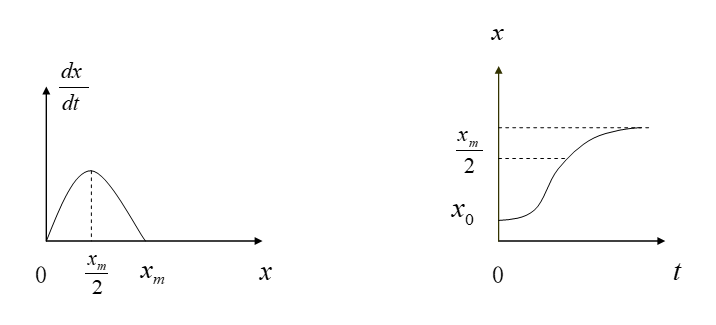
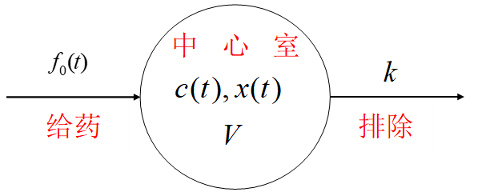

# 第二章：微积分方法建模

### overview:

涉及连续的变量，可以用微积分求解，求得解析式便于下一步分析。有些离散的变量也可以演变成连续变量进行求解。当我们描述实际对象的某些特性随时间（或空间）而演变的过程，分析它的变化规律，预测它的未来性态时，通常要==建立对象的动态模型==。建模时首先要根据建模目的和对问题的具体分析作出*简化假设*，然后按照对象内在的或可以类比的其它对象的规律列出微分方程，求出方程的解并将结果翻译回实际对象，就可以进行描述、分析或预测了。

## 2.1飞机降落曲线

飞机降落时，其曲线是一条三次抛物线，如下图：

水平速度为常数u，出于安全考虑，飞机的垂直加速度不得超过g/10，已知飞行高度h，要求在坐标原点降落，求开始下降点x~0~允许的最小值。

### 求曲线解析式

设飞机降落曲线为：

$y = ax^3+bx^2+cx+d$

依据假设可知：
$y(0)=0,y(x_0)=h,y'(0)=0,y'(x_0)=0$，带入上式可得：

$$
\small
\begin{cases}
    y(0)=d=0,\\
    y'(0)=c=0,\\
    y(x_0)=ax^3+bx^2+cx+d=h,\\
    y'(x_0)=3ax^2+2bx_0+c=0x=0\\
\end{cases}
$$
所以:
$a = -\frac{2h}{{x_0}^3},b=\frac{3h}{{x_0}^2},c=0,d=0$

其曲线为：
$y=-\frac{h}{{x_0}^2}(\frac{2}{x_0}x^3-3x^2)$

### 求最佳着陆点

飞机垂直速度是y关于时间t的导数：
$\frac{dy}{dt}=-\frac{h}{{x_0}^2}(\frac{6}{x_0}x^2-6x)\frac{dx}{dt}$

其中，$\frac{dx}{dt}$是飞机水平速度，所以$\frac{dx}{dt}=u$，则：
$\frac{dy}{dt}=-\frac{6hu}{{x_0}^2}(\frac{x^2}{x_0}-x)$

垂直加速度为：$\frac{d^2y}{dt^2}=-\frac{6hu}{{x_0}^2}(\frac{2x}{x_0}-1)\frac{dx}{dt}=-\frac{6hu^2}{x_0^2}(\frac{2x}{x_0}-1)$

设$a(x)=\frac{d^2y}{dt^2}$,则：

$|a(x)|=\frac{6hu^2}{{x_0}^2}|\frac{2x}{x_0}-1|,x\in[0,x_0]$

所以，垂直加速度最大值为：

$max|a(x)|=\frac{6hu^2}{{x_0}^2},x\in[0,x_0]$

由于题目限制：$max|a(x)|\leq\frac{g}{10}$，所以：

$x_0\geq u\sqrt{\frac{60h}{g}}$，此为$x_0$的最小值。

## 2.2经济增长模型

发展经济、增加生产有两个重要因素，一是==增加投资==（扩大厂房、购买设备、技术革新等），二是==增加劳动力==。恰当调节投资增长和劳动力增长的关系，*==使增加的产量不致被劳动力的增长抵消==，劳动生产率才能不断提高*，从而真正起到发展经济的作用。为此，需要==分析产量、劳动力和投资之间变化规律==，从而保证经济正常发展。
假设：
$Q(t)$——地区、部门、企业在某时间t的产量
$L(t)$——地区、部门、企业在某时间t的劳动力
$K(t)$——地区、部门、企业在某时间t的资金
$Z(t)$——每个劳动力在某时间t所占有的产量（劳动力生产率）

### 道格拉斯（Douglas）生产函数

由于我们只关心产量、劳动力、投资的相对增长，而不是绝对量，所以定义：
产量指数：$i_Q(t) = \frac{Q(t)}{Q(0)}$，劳动力指数：$i_L(t) = \frac{L(t)}{L(0)}$，投资指数：$i_K(t) = \frac{K(t)}{K(0)}$ （1）
令：$\xi(t)=\ln\frac{i_L(t)}{i_K(t)}$,$\psi(t)=\ln\frac{i_Q(t)}{i_K(t)}$ （2）
根据统计数据,散点$(\xi,\psi)$在直角坐标系下的图像大致为：

由图可知，大多数的点处在一条经过原点的直线附近，故$\xi$和$\psi$有如下关系：

$\psi=\gamma\xi  (0<\gamma<1)$ （3）
带入上式可得：
$i_Q(t)={i_L}^\gamma(t){i_K}^{1-\gamma}(t)$ （4）
记$a=Q(0)L^{-\gamma}(0)K^{1-\gamma}(0)$,则由（1）和（4）可知:
$Q(t)=aL^\gamma(t)K^{1-\gamma}(t)$ （5）
式（5）就是经济学中著名的Douglas生产函数，它表明产量余劳动力、投资之间的关系，即：
$\frac{\dot{Q}}{Q}=\gamma\frac{\dot{L}}{L}+(1-\gamma)\frac{\dot{K}}{K}$ （6）
其中$\dot{Q}$、$\dot{L}$、$\dot{K}$表示Q、L、K关于t的导数。
这个函数表明，相对增长量，$\frac{\dot{Q}}{Q}$、$\frac{\dot{L}}{L}$、$\frac{\dot{K}}{K}$之间呈线性关系，当$\gamma\rightarrow1$时产量增长主要依靠劳动力增长，当$\gamma\rightarrow0$时产量增长主要依靠投资。亦称$\gamma$为==产量对劳动力的弹性系数==

### 劳动生产率增长条件

定义劳动生产率$Z(t)=\frac{Q(t)}{L(t)}$，则$\frac{\dot{Z}}{Z}=\frac{\dot{Q}}{Q}-\frac{\dot{L}}{L}$,将（6）代入$Z(t)$可得：
$\frac{\dot{Z}}{Z}=(1-\gamma)(\frac{\dot{K}}{K}-\frac{\dot{L}}{L})$ （7）
由（7）可见，只要$\frac{\dot{K}}{K}>\frac{\dot{L}}{L}$就能保证$\frac{\dot{Z}}{Z}>0$,即==劳动生产率的提高需要由投资的相对增长大于劳动力的相对增长为前提条件==。

## 2.3存贮模型

原料、商品的存贮问题，存的太多，存贮费用过高；存的太少，无法及时满足需求。目的：==制定最有存贮策略==，即：多长时间顶一次货，每次顶多少货，才能使总费用最小。

### 模型一

#### 模型假设：

- 每次订货费用为$C_1$，每天每吨货物贮存费用为$C_2$(已知)
-  每天货物的需求量r吨为已知
-  订货周期为T天，每次订货Q吨，当贮存量降到0时订货立即到达。

#### 模型建立

订货周期、订货量余每天的需求量存在关系：
$Q=rT$
订货以后贮存量$q(t)$均匀地下降，即$q(t)=Q-rt$,如下图：

则一个订货周期的费用：
$$
\small
\begin{cases}
    订货费:C_1,\\
    存贮费:\int_{0}^{T}q(t)\,dt=\frac{1}{2}C_2QT=\frac{1}{2}C_2rT^2\\
\end{cases}
$$
即：$C(T)=C_1+\frac{1}{2}C_2rT^2$
则一个订货周期每天的费用为：$\overline{C}(T)=\frac{C_1}{T}+\frac{1}{2}C_2rT$

#### 模型求解

令$\frac{d\overline{C}}{dT}=0$,可求得：$T=\sqrt{\frac{2c_1}{RC_2}}$
进而：$Q=\sqrt{\frac{2C_1r}{C_2}}$
此模型称为==经济订货批量公式==，简称EOQ公式

### 模型二：允许缺货的存贮模型

#### 模型假设：

- 每次订货费用为$C_1$,每天每吨货物贮存费用$C_2$(已知)
- 每天的货物需求量r吨（已知）
- 订货周期为T天，订货量Q，允许缺货，每天每吨货物缺货费$C_3$（已知）

#### 模型建立

缺货时的存储量q视为负值，则$q(t)$的图像如下，货物在$t=T_1$时用完，于时$Q=rT_1$

则一个订货周期内总费用为：
$$
\small
\begin{cases}
    订货费:C_1,\\
    存贮费:\int_{0}^{T_1}q(t)\,dt=\frac{1}{2}C_2QT_1=\frac{1}{2}C_2\frac{Q^2}{r},\\
    缺货费:\int_{T_1}^{T}|q(t)|\,dt=\frac{C_3}{2}r(T-T_1)^2=\frac{C_3}{2r}(rT-Q)^2
\end{cases}
$$
即：$C(T,Q)=C_1+\frac{1}{2}C_2Q^2\frac{1}{r}+\frac{1}{2r}C_3(rT-Q)^2$
则平均每天的费用为：
$\overline{C}(T,Q)=\frac{C(T,Q)}{T}=\frac{C_1}{T}+\frac{C_2Q^2}{2rT}+\frac{C_3(rT-Q)^2}{2rT}$

#### 模型求解

$$
\small
\begin{cases}
    \frac{\partial\overline{C}}{\partial T}=0\\
    \frac{\partial\overline{C}}{\partial Q}=0
\end{cases}
$$
求出T、Q的最优解，分别记为$T'、Q'$
$T'=\sqrt{\frac{2C_1}{rC_2}\frac{C_2+C_3}{C_3}},Q'=\sqrt{\frac{2C_1r}{C_2}\frac{C_3}{C_2+C_3}}$

#### 分析

令$\mu=\sqrt{\frac{C_2+C_3}{C_3}}$,与模型一相比，有：
$T'=\mu T,Q'=\frac{Q}{\mu}$
显然，T' > T,Q' < Q,即在允许缺货时应增大订货周期，减少订货批次；当缺货非$C_3$相对于存贮费$C_2$而言越大时，$\mu$越小，T'和Q'越接近T和Q。

## 2.4城市人口统计模型

### 模型一（估算城市现有人口）

城市人口密度常用$P(r)=\frac{b}{r^2+a}$或者$P(r)=ae^{-br}(a,b>0)$来近似表示，其中r是距城中心的距离。则计算距离市中心C区域内的人口数N可以这样：从城市中心画一条射线，把这条线上从0到C之间n等分，每小区间长度为$\Delta r$，每小区间确定一个圆环，第j个圆环面积为从城市中心为：
$\pi{r_j}^2-\pi{r_{j-1}}^2=\pi{r_j}^2-\pi(r_j-\Delta r)^2=2\pi r_j\Delta r-\pi(\Delta r)^2\approx2\pi r_j \Delta r$  $(\Delta r很小)$

第j个圆环上的人口数近似为$P(r_j)2\pi r_j \Delta r$,所以：

$N\approx \sum_{j=1}^{n}P(r_j) 2\pi r_j \Delta r$

令$n\rightarrow\infty$时，

$N=\int_{0}^{C}P(r)2\pi r\,dr$

### 模型二（预测城市未来人口）

P(t)表示t时刻的城市人口数量，人口变化手下面规则的影响：

- t时刻的净增长人口以每年r(t)的比率增加
- 在一段世界内，由于自然死亡和人口迁移，$T_1$时刻的人口数$P(T_1)$的一部分在$T_2$时刻仍然存在，用$h(T_2-T_1)P(T_1)$来表示，这里$0<h(T_2-T_1)<1$，$T_2-T_1$是这段时间的长度。

把(0,T]时间划分为n等分，每个小区间长度为$\Delta t$。
假设初始时刻人口为P(0)，到时刻T将只剩h(T)P(0)。当$\Delta t$很小的时候，从$t_{j-1}$到$t_j$，净增长的人口比率近似为常数$r(t_j)$。这段时间净增的人口数近似为$r(t_j)\Delta t$,在$t_j$时刻的人口到T时刻只剩$h(T-t_j)r(t_j)\Delta t$。所以在T时刻的总人口数近似为：

$P(T)\approx h(T)P(0)+\sum_{j=1}^{n}h(T-t_j)r(t_j)\Delta t$

令$n\rightarrow\infty$，得：

$P(T)=h(T)P(0)+\int_{0}^{T}h(T-t)r(t)\,dt$

## 2.7古生物年代确定

主要思路：$C^{14}$的半衰期为5568年，根据$C^{14}$的蜕变减少量的变化来判断生物的死亡时间。

### 模型假设

- 地球周围大气的$C^{14}$可以认为不变，现代生物和古代生物体内的$C^{14}$蜕变速度一致。
- 由原子物理学，$C^{14}$的蜕变速度与该时刻的$C^{14}$含量成正比。

### 模型建立

记，$x(t)$代表t时刻生物体内$C^{14}$的含量。由假设可知：$\frac{dx}{dt}=-kx,k>0 （1）$
（1）的通解为$x(t)=Ce^{-kt}$，设生物死亡时间为$t_0$，代入可知，$C=x_0$，于时：
$x(t)=x_0e^{-kt} (2)$
记$C^{14}$的半衰期为T，则有：
$x(T)=\frac{x_0}{2} （3）$
将（3）代入（2）可得$k=\frac{ln2}{T}$，故可解得：
$t=\frac{T}{ln2}ln\frac{x_0}{x(t)} （4）$
由于$x_0和x(t)$难以测量，故使用另一种方法求t：
对（2）两边求导：
$x'(t)=-x_0ke^{-kt}=-kx(t)$
$x'(0)=-kx(0)=-kx_0$
两式相除，可得：$\frac{x'(t)}{x'(0)}=\frac{x_0}{x(t)}$,代入(4)可得：
$t=\frac{T}{ln2}ln\frac{x'(0)}{x'(t)}$
所以只需要测出标本$C^14$的平均蜕变速度（单位：次/分钟），即$x'(t)$，和现在的$C^14$的蜕变速度$x'(0)$，即可求出t。

## 2.8预测人口的增长

### 模型一：Malthhus指数增长模型

#### 模型假设
1.某国/地区再t时刻的人口数x(t)为连续可微函数。
2.人口的增长率r是常数，即，单位时间人口的增长量与当时的人口成正比

#### 模型建立
记$x_0$为初始时刻的人口，即$x(0)=x_0$
则从$t$到$t+\Delta t$内人口的增长量为：
$x(t+\Delta t)-x(t)=rx(t)\Delta t$
可导出下面的微分方程：
$$
\small
\begin{cases}
    \frac{dx}{dt}=rx\\
    x(0)=x_0
\end{cases}
$$
解得：$x(t)=x_0e^{rt}  ,r>0$

### 模型二：Logistic阻滞增长模型

#### 模型假设

1.同模型一
2.==当人口增加到一定数量后，增长率随着人口的继续增长而逐渐减少==，且r(x)为x的线性函数$r(x)=r-sx$，其中r为x=0时的增长率，成为固有增长率。
3.自然资源和环境条件所能容纳的最大人口数量为$x_m$，称作最大人口容量

#### 模型建立

当$x=x_m$时，增长率为0，即$r(x_m)=0$,进而：$S=\frac{r}{x_m}$,所以：$r(x)=r(1-\frac{x}{x_m})$
其中的$r,x_m$是根据人口统计数据确定的常数，$x_m$常由经验决定(==模型缺点：$x_m$不易轻易地得到==)。
模仿模型一可得：
$$
\small
\begin{cases}
    \frac{dx}{dt}=r(1-\frac{x}{x_m})x\\
    x(0)=x_0
\end{cases}
$$
解得：$x(t)=\frac{x_m}{1+(\frac{x_m}{x_0})e^{-rt}}$

## 2.9药物在体内地分布与排除

### 模型背景
药物进入机体后，在随血液输送到各器官和组织的过程中，不断地被吸收、分布、代谢，最终排出体外。药物在血液中的浓度($\mu g/mv$)称==血药浓度==。血药浓度的大小直接影响到药物的疗效，浓度太低不能达到预期的治疗效果，浓度太高又可能导致中毒、副作用太强或造成浪费。
因此，==研究药物在体内吸收、分布和排除的动态过程==，对于新药研制时剂量的确定、给药方案设计等药理学和临床医学的发展具有重要的指导意义和实用价值。
为了研究目的，==将一个机体划分成若干个房室，每个房室是机体的一部分==，比如中心室和周边室。在一个房室内药物呈均匀分布，而在不同的房室之间按一定规律进行转移。

### 模型假设
1.药物进入机体后，全部进入中心室（血液较丰富的心、肺、肾等器官和组织），中心室的容积在给药过程中保持不变；
2.药物从中心室排出体外，与排除的数量相比，药物的吸收可以忽略；
3.药物排除的速率与中心室的血药浓度成正比。

### 模型建立
$f_0(t)：给药速度$
$c(t)：中心室血药浓度$
$x(t)：中心室药量$
$V：中心室容积$
$k：排除速率系数$

### 求各种给药方式下血药浓度变化情况

上述变量有如下关系:
$\dot{x}=f_0(t)-kx$
即$\dot{x}+kx=f_0(x)$
又$x(t)=Vc(t)$
可得：$\dot{c}(t)+kc(t)=\frac{f_0(t)}{V} （1）$

- 1.快速静脉注射(指数模型)
  给药量为D，则初始条件$c(0)=\frac{D}{V},f_0(t)=0$
  解得：$c(t)=\frac{D}{V}e^{-kt} （2）$
- 2.恒速静脉注射
  设持续时间为$\tau$,注射速率为$k_0$，则有：
  当$(x\le t\le\tau)$时，$f_0(t)=k_0$,初始条件为c(0)=0,
  当$(t\ge\tau)$时，$f_0(t)=0$,初始条件$c(\tau)=\frac{k_0}{Vk}(1-e^{-k\tau})$,所以（1）的解为：
    $$
    \small c(t)=
    \begin{cases}
        \frac{k_0}{Vk}(1-e^{-kt}) ,0\le t\le\tau \\
        \frac{k_0}{Vk}(1-e^{-k\tau})e^{-k(t-\tau)},t\ge\tau （3）
    \end{cases}
    $$
  
- 3.口服或肌肉注射
  在药物输入中心室之前先有一个将药物吸入血液的过程，可以看作有一个吸收室，药物由吸收室进入中心室，药物由吸收室进入中心室额转移速率系数记为$k_1$，给药量D，吸收室药量$x_0(t)$。则有：
  
  $$
  \small
  \begin{cases}
      \dot{x_0}=-k_1x_0\\
      x_0(t)=D
  \end{cases}
  $$
  上式可推出：$x_0(t)=De^{-k_1t}$
  于时$f_0(t)=k_1De^{-k_1t}$初始条件c(0)=0,（1）的解为：
  $c(t)=\frac{k_1D}{V(k_1-k)}(e^{-kt}-e^{-k_1t}) , k_1>k （4）$
  

## 2.10导弹跟踪
