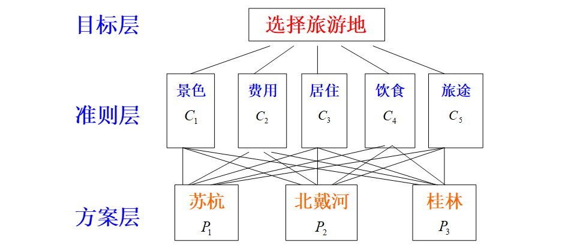

# CH3代数方法建模

## 3.4层次分析法

### 背景
某些问题的一个共同特点是它们都通常涉及到经济、社会、人文等方面的因素。==在作比较、判断、评价、决策时，这些因素的重要性、影响力或者优先程度往往难以量化==，人的主观选择会起着相当重要的作用，这就给用一般的数学方法(机理分析和统计分析)解决问题带来本质上的困难。例如：

- 国家综合实力分析需要考虑到国民收入、军事、科技、社会稳定、外贸等方面的因素
- 资源开发的综合判断需要考虑潜在经济价值、开采费用、风险、需求、战略重要性、交通条件等因素
- 大学生毕业工作选择需要考虑贡献、收入、发展、声誉、关系、位置等因素
- 科技成果的综合评价

*层次分析法(简记AHP)*是一种定性和定量相结合的,系统化,层次化的分析方法，由T.L.Saaty等人在七十年代提出，是一种能有效地处理这样一类问题的实用方法。从处理问题的类型上分类，主要是决策、评价、分析、预测等。

### AHP的基本步骤

#### 1.建立层次结构模型

在深入分析实际问题的基础上,将有关的各个因素按不同属性自上而下地分解成若干层次。==同一层次的诸因素从属于上一层的因素或对上层因素有影响,同时又支配下一层的因素或受下层因素的作用==,最上层为目标层,最下层为方案层,中间可有1个或几个层次,称为准则层。

#### 2.构成对比较矩阵

从层次结构模型的第二层开始，对于从属于上一层每个因素的同一层诸因素，用成对比较法和1-9比较尺度构造成对比较阵，直到最下层。
例如要比较$C_1,C_2,C_3,...,C_n$对上层因素O的影响，每次取两个因素$C_i,C_j$，用$a_{ij}$表示$C_i,C_j$对O的影响之比。所有的比较结果用比较矩阵$A=(a_{ij})_{n\times n},a_{ij}>0,a_{ji}=\frac{1}{a_{ij}}$来表示，这里的$a_{ij}$是相对比较尺度，其含义为：
|尺度$a_{ij}$|含义|
|-|-|
|1|$C_i$对$C_j$的影响==相同==|
|3|$C_i$对$C_j$的影响*稍强*|
|5|$C_i$对$C_j$的影响*强*|
|7|$C_i$对$C_j$的影响*明显地强=*|
|9|$C_i$对$C_j$的影响==绝对地强==|
|2,4,6,8|$C_i$对$C_j$的影响之比在上述两相邻等级之间|

#### 3.计算权向量并作一致向检验

对于承兑比较矩阵A，应满足$a_{ij}\cdot a_{jk}=a_{ik}(i,j,k=1,2,3,...,n)$，则称A为一致性矩阵，有如下性质：

- 1.rank A=1,A的唯一非零特征根为n
- 2.A的任一列向量都是对应于特征根n的特征向量

因此自然应取对应特征根n的，归一化的特征向量（即分量之和为1）表示诸因素$C_1,C_2,C_3,...,C_n$对上层因素O的权重，这个特征向量称为权向量。
一般成对比较矩阵不容易做到完全一致，因为矩阵A的特征根和特征向量连续地依赖于矩阵的元素$a_{ij}$，所以当$a_{ij}$离一致性的要求不远时，A的特征根和特征向量也与一致阵相差不大，Saaty等人建议，如果成对比较阵A不是一致阵，但在不一致的容许范围内，仍可以用对应于A的最大特征根$\lambda$的特征向量（归一化）作为权向量**W**。
要确定A的不一致程度的容许范围，就要进行一致性检验，其步骤为：

- 1.计算一致性指标$CI=\frac{\lambda-n}{n-1}$；
- 2.查下表得出随机一致向指标RI的数值：
  |n|1|2|3|4|5|6|7|8|9|10|11|
  |-|-|-|-|-|-|-|-|-|-|-|-|
  |RI|0|0|0.58|0.90|1.12|1.24|1.32|1.41|1.45|1.49|1.51|
- 3
  - 对$n\ge3$，计算一致性比率$CR=\frac{CI}{RI}$;
  - 对$CR<0.1$，认为A的不一致程度在容许范围内，可以用其特征向量作为权向量，否则就要从小构造对比矩阵。

#### 4.计算组合权向量并做组合一致性检验

由各准则对目标的权向量$W^{(2)}$和各方案对于每个准则的权向量$W_k^{(3)}(k=1,2,...,n)$，计算各方案对目标的权向量$W^{(3)}$，称为组合权向量，计算方法如下：
以$W_k^{(3)}$为列向量构成矩阵$W^{(3)}=[W_1^{(3)},W_2^{(3)},...,W_n^{(3)}]$，则第三次对第一层的组合权向量$W^{(3)}$为$W^{(3)}=W^{(3)}W^{(2)}$。
在层次分析的整个计算过程中，除了对每个成对比较阵进行一致性检验，以判断每个权向量是否可以应用外，还应==对最后结果进行组合一致性检验==，以确定组合权向量是否可以作为最终的决策依据。
