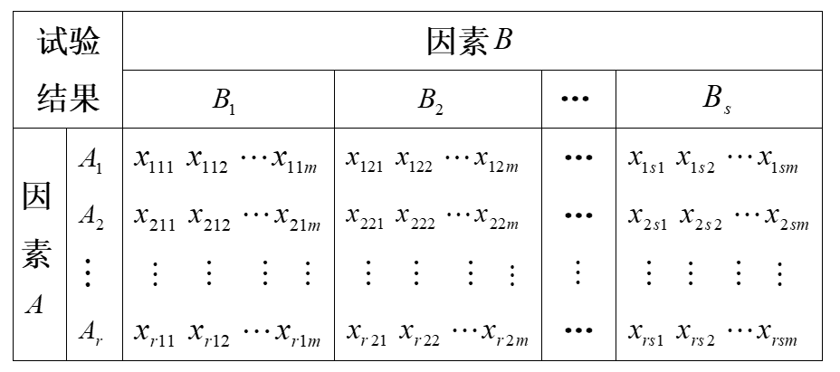

# CH4统计方法建模

## 4.5方差分析

在科学研究中，经常需要分析各种因素对实验指标是否有显著影响，要解决这个问题，一方面是要设计一个实验，使其充分反映各因素的作用，并力求试验次数尽可能少；另一方面要对实验结果的数据进行合理的分析。

### 单因素方差分析

仅考虑一个因素A对于实验指标有无显著影响，可令A取r个值：$A_1,A_2,...,A_r$,称为单因素试验，其结果$x_{ij}$如下：
|序号|1|2|...|$n_i$|
|-|-|-|-|-|
|$A_1$|$x_{11}$|$x_{12}$|...|$x_{1n_i}$|
|$A_2$|$x_{21}$|$x_{22}$|...|$x_{2n_i}$|
|...|...|...|...|...|
|$A_r$|$x_{r1}$|$x_{r2}$|...|$x_{rn_i}$|
假设在$A_i$下的数据$x_{i1},x_{i2},...,x_{in_i}$来自$X_i$~$N(\mu_i,\sigma^2)$，检验如下假设：
$H_0:\mu_1=\mu_2=...=\mu_r,H_1:\mu_1,\mu_2,...,\mu_r不全相等$
检验统计量为：
$F=\frac{\frac{S_A}{r-1}}{\frac{S_e}{n-r}}$~$F(r-1,n-r)$
上式中，
$S_A=\sum_{i=1}^{r}\sum_{j=1}^{n_i}(\overline{x_i}-\overline{x})^2=\sum_{i=1}^{r}(\overline{x_i}-\overline{x})^2$，称为组间差平方和。
$S_e=\sum_{i=1}^{r}\sum_{j=1}^{n_i}(x_{ij}-\overline{x_i})^2$，称为组内差平方和。
其中，$n=\sum_{i=1}^{r}n_i,\\\overline{x_i}=\frac{1}{n}\sum_{j=1}^{n_i}x_{ij},\\\overline{x}=\frac{1}{n}\sum_{i=1}^{r}\sum_{j=1}^{n_i}x_{ij}$
对于给定的显著性水平$\alpha(\alpha=0.0 or 0.05)$，如果$F>F_\alpha(r-1,n-r)$，则拒绝$H_0$，即认为A对实验指标有显著影响。
在实际计算时，可以先对原始数据做如下处理：
$x_{ij}'=\frac{x_{ij}-a}{b}$，不会影响F值的大小。
通常采用如下简便记法：
$T_i=\sum_{j=1}^{n_i}x_{ij} (i=1,2,...,r)$
$T=\sum_{i=1}^{r}\sum_{j=1}^{n_i}x_{ij}$
则有：
$S_A=\sum_{i=1}^{r}\frac{T_i^2}{n_i}-\frac{T^2}{n}$
$S_e=\sum_{i=1}^{r}\sum_{j=1}^{n_i}x_{ij}^2-\sum_{i=1}^{r}\frac{T_i^2}{n_i}$
可得方差分析表：
|方差来源|平方和|自由度|F值|检验p值|
|-|-|-|-|-|
|因素A|$S_A$|r-1|$F=\frac{S_A/(r-1)}{S_e/(n-r)}$||
|误差E|$S_e$|n-r|||
|总和|$S_A+S_e$|n-1|||

### 双因素方差分析

同时考察两个因素A、B对于试验指标有无显著影响，可以让A取r个水平：$A_1,A_2,...,A_r$，让B取r个水平：$B_1,B_2,...,B_r$，在各种水平配合$(A_i,B_j)$下进行实验，称为双因素实验。

#### 1.无交互作用得双因素方差分析

在没中过水平配合$(A_i,B_j)$下做实验，称为无交互作用得双因素实验，检验结果$x_{ij}$如下表：
|因素|$B_1$|$B_2$|...|$B_S$|
|-|-|-|-|-|
|$A_1$|$x_{11}$|$x_{12}$|...|$x_{1s}$|
|$A_2$|$x_{21}$|$x_{22}$|...|$x_{2s}$|
|...|...|...|...|...|
|$A_r$|$x_{r1}$|$x_{r2}$|...|$x_{rs}$|
并假设在水平配合$(A_i,B_j)$下的数据$x_{ij}$来自整体$X_{ij}$~$N(\mu_{ij},\sigma^2),(i=1,2,...,r;j=1,2,...,s)$
检验如下假设：
$H_{0A}:\mu_1.=\mu_2.=...=\mu_r.,H_{1A}:\mu_1.,\mu_2.,...,\mu_r.不全相等$
$H_{0B}:\mu_{.1}=\mu_{.2}=...=\mu_{.r},H_{1B}:\mu_{.1},\mu_{.2},...,\mu_{.r}不全相等$
检验统计量为：
$F_A=\frac{\frac{S_A}{r-1}}{\frac{S_e}{n-r}}$~$F(r-1,n-r)$
$F_B=\frac{\frac{S_B}{r-1}}{\frac{S_e}{n-r}}$~$F(r-1,n-r)$
上式中，
$S_A=\sum_{i=1}^{r}\sum_{j=1}^{s}(\overline{x_i.}-\overline{x})^2=\sum_{i=1}^{r}(\overline{x_i.}-\overline{x})^2$，称为A的组间差平方和。
$S_B=\sum_{i=1}^{r}\sum_{j=1}^{s}(\overline{x_{.j}}-\overline{x})^2=\sum_{i=1}^{s}(\overline{x_{.j}}-\overline{x})^2$，称为B的组间差平方和。
$S_e=\sum_{i=1}^{r}\sum_{j=1}^{n_i}(x_{ij}-\overline{x_i})^2$，称为组内差平方和。
其中，$\overline{x_i.}=\frac{1}{s}\sum_{j=1}^{s}x_{ij},\\\overline{x_{.j}}=\frac{1}{r}\sum_{j=1}^{r}x_{ij},\\\overline{x}=\frac{1}{rs}\sum_{i=1}^{r}\sum_{j=1}^{s}x_{ij}$
对于给定的显著性水平$\alpha(\alpha=0.0 or 0.05)$，
如果$F_A>F_\alpha(r-1,(r-1))(s-1))$，则拒绝$H_{0A}$，即认为A对实验指标有显著影响。
如果$F_B>F_\alpha(r-1,(r-1)(s-1)))$，则拒绝$H_{0B}$，即认为B对时延指标有显著影响。
在实际计算时，可以先对原始数据做如下处理：
$x_{ij}'=\frac{x_{ij}-a}{b}$，不会影响$F_A、F_B$值的大小。
|方差来源|平方和|自由度|F值|检验p值|
|-|-|-|-|-|
|因素A|$S_A$|r-1|$F=\frac{S_A/(r-1)}{S_e/(n-r)}$||
|因素B|$S_B$|r-1|$F=\frac{S_A/(r-1)}{S_e/(n-r)}$||
|误差E|$S_e$|(r-1)(s-1)|||
|总和|$S_A+S_B+S_e$|rs-1|||

#### 2.有交互作用的双因素方差分析

在每一种水平配合$(A_i,B_j)$下重复作$m(m\geq2)$次实验，称之为==有交互的双因素试验==，其结果如下：

假设在水平配合$(A_i,B_j)$下的数据$x_{ij1},x_{ij2,...,x_{ijm}}$来自总体$X_{ij}$~$N(\mu_{ij},\sigma^2),(i=1,2,...,r;j=1,2,...,s)$。
假设检验如下：
$H_{0A}:\mu_{1.}=\mu_{2.}=...=\mu_{r.},H_{1A}:\mu_{1.},\mu_{2.},...,\mu_{r.}不全相等$
$H_{0B}:\mu_{.1}=\mu_{.2}=...=\mu_{.s},H_{1B}:\mu_{.1},\mu_{.2},...,\mu_{.r}不全相等$
$H_{0AB}:\mu_{ij}全相等，H_{1AB}:\mu_{ij}不全相等$
分别用如下检验统计量：
$F_A=\frac{S_A/(r-1)}{S_e/rs(m-1)}$~$F(r-1,rs(m-1))$
$F_B=\frac{S_B/(r-1)}{S_e/rs(m-1)}$~$F(s-1,rs(m-1))$
$F_{AB}=\frac{S_{AB}/(r-1)(s-1)}{S_e/rs(m-1)}$~$F((r-1)(s-1),rs(m-1))$
其中，
$S_A=\sum_{i=1}^{r}\sum_{j=1}^{s}\sum_{k=1}^{m}(\overline{x_{i.}}-\overline{x})^2=\sum_{i=1}^{r}sm(\overline{x_{i.}}-\overline{x})^2$称为==A的组件差平方和==。
$S_B=\sum_{i=1}^{r}\sum_{j=1}^{s}\sum_{k=1}^{m}(\overline{x_{.j}}-\overline{x})^2=\sum_{i=1}^{r}sm(\overline{x_{.j}}-\overline{x})^2$称为==B的组件差平方和==。
$S_{AB}=\sum_{i=1}^{r}\sum_{j=1}^{s}\sum_{k=1}^{m}(\overline{x_{ij}}-\overline{x_{i.}}-\overline{x_{.j}}+\overline{x})^2=m\sum_{i=1}^{r}\sum_{j=1}^{s}(\overline{x_{ij}}-\overline{x_{i.}}-\overline{x_{.j}}+\overline{x})^2$称为==A*B的组件差平方和==。
$S_e=\sum_{i=1}^{r}\sum_{j=1}^{s}\sum_{k=1}^{m}(x_{ijk}-\overline{x_{ij}})^2$称为==组内差平方和==
这里：
$\overline{x_{i.}}=\frac{1}{sm}\sum_{j=1}^{s}\sum_{k=1}^{m}x_{ijk}$
$\overline{x_{.j}}=\frac{1}{rm}\sum_{i=1}^{r}\sum_{k=1}^{m}x_{ijk}$
$\overline{x_{ij}}=\frac{1}{m}\sum_{k=1}^{m}x_{ijk}$
$\overline{x}=\frac{1}{rsm}\sum_{i=1}^{r}\sum_{j=1}^{s}\sum_{k=1}^{m}x_{ijk}$
对于给定的显著性水平$\alpha(\alpha=0.0 or 0.05)$，
如果$F_A>F_\alpha(r-1,rs(m-1))$，则拒绝$H_{0A}$，即认为A对实验指标有显著影响。
如果$F_B>F_\alpha(r-1,rs(m-1))$，则拒绝$H_{0B}$，即认为B对时延指标有显著影响。
如果$F_{AB}>F_\alpha((r-1)(s-1),rs(m-1))$，则拒绝$H_{0AB}$，即认为A与B的交互效应对实验指标有显著影响。

在实际计算时，可以先对原始数据做如下处理：
$x_{ij}'=\frac{x_{ij}-a}{b}$，不会影响$F_A、F_B、F_{AB}$值的大小。

**方差分析表**：
|方差来源|平方和|自由度|均方|检验F值|p|
|-|-|-|-|-|-|
|因素A|$S_A$|r-1|$\frac{S_A}{r-1}$|$F=\frac{S_A/(r-1)}{S_e/rs(m-1)}$||
|因素B|$S_B$|r-1|$\frac{S_B}{s-1}$|$F=\frac{S_B/(s-1)}{S_e/rs(m-1)}$||
|交互AB|$S_{AB}$|(r-1)(s-1)|$\frac{S_{AB}}{(r-1)(s-1)}$|$F=\frac{S_A/(r-1)(s-1)}{S_e/rs(m-1)}$||
|误差E|$S_e$|rs(m-1)|$\frac{S_e}{rs(m-1)}$||
|总和|$S_A+S_B+S_{AB}+S_e$|rsm-1|||

## 4.6回归分析

### 一、多元线性回归

如果随机变量Y与固定变量$x_1,x_2,...,x_m$之间有明显的线性关系，即：$Y=b_0+b_1x_1+b_2x_2+...+b_mx_m+\epsilon,\epsilon$~$N(0,\sigma^2)$称为m元线性回归模型。

#### 1.模型中的参数估计——回归方程的建立

设通过试验/历史资料得到的观测数据$(x_{i1},x_{i2},...,x_{im},y_i),(i=1,2,...,n)$
令
$$
Y=
\begin{pmatrix}
    y_1\\
    y_2\\
    .\\
    .\\
    .\\
    y_n
\end{pmatrix}
$$
$$
X=
\begin{pmatrix}
    1&x_{11}&x_{12}&...&x_{1m}\\
    1&x_{21}&x_{22}&...&x_{2m}\\
    .&.&.&...&.\\
    .&.&.&...&.\\
    .&.&.&...&.\\
    1&x_{n1}&x_{n2}&...&x_{nm}\\
\end{pmatrix}
$$
$$B=
\begin{pmatrix}
    b_0\\
    b_1\\
    .\\
    .\\
    .\\
    b_m
\end{pmatrix}
$$
由最下二乘估计，可得：$\hat{B}=(X^TX)^{-1}X^TY$
称$\hat{Y}=\hat{b_0}+\hat{b_1}x_{i1}+\hat{b_2}x_{i2}+...+\hat{b_m}x_{im}(i=1,2,...,n)$

#### 2.显著性检验

##### (1)回归模型的显著性检验

即检验假设$H_0:b_1=b_2=...=b_m=0,H_1:b_i不全为0$，令$S_R=\sum_{i=1}^{n}(\hat{y_i}-\overline{y})^2,S_e=\sum_{i=1}^{n}(y_i-\hat{y_i})^2$
检验统计量：
$F=\frac{S_R/m}{S_e/(n-m-1)}$~$F(m,n-m-1)$对于一个小概率$\alpha$，若$F>F_\alpha(m,n-m-1)$,则拒绝$H_0$，认为所见的回归方程正确。

##### (2)各自变量的显著性检验（回归系数的显著性检验）

检验假设：$H_{{0j}}:b_j=0,H_{1j}:b_j\not ={0}(j=1,2...m)$
检验统计量：$t_j=\frac{\hat{b_j}}{\sqrt{c_{jj}S_e/(n-m-1)}}$~$t(n-m-1),(j=1,2,...,m)$
这里$c_{jj}$是矩阵$C=(X^TX)^{-1}$中相应位置的元素。
对于一个小概率$\alpha$，若$|t_j|>t_{\frac{\alpha}{2}(n-m-1)}$，则拒绝$H_{0j}$，应保留变量$x_j$，否则应剔除变量$x_j$

#### 3.利用回归方程进行预报

当$(x_1,x_2,...,x_m)=(x_{01},x_{02},...,x_{0m})$时，对Y进行预测

- 点预测：$\hat{y_0}=\hat{b_0}+\hat{b_1}x_{01}+\hat{b_2}x_{02}+...+\hat{b_m}x_{0m}$
- 区间预测：Y的置信度为$1-\alpha$的置信区间$(\hat{y_0}-\delta(x_0),\hat{y_0}+\delta(x_0))$,其中$\delta(x_0)=t_{\frac{\alpha}{2}}(n-m-1)\hat{\sigma}\sqrt{1+\frac{1}{n}+\sum_{i=1}^{m}\sum_{j=1}^{m}(x_{0i}-\overline{x_i})c_{ij}}$

## 4.7判别分析的应用

在科学研究、生产实践、社会生活中，经常会遇到==如何根据观测到的数据资料，对所研究的对象进行判别归类==的问题。
判别分析问题可以这样描述：设有总体$G_1,G_2,...,G_m$，每个总体都有指标$x_1,x_2,...,x_p$，通过来自总体$G_i(i=1,2,...,m)$的样品$x_1^{(i)},x_2^{(i)},...,x_{n_i}^{(i)}$，建立判别函数$f(x_1,x_2,...,x_p)$。对任一待判样本$x=(x_1,x_2,...,x_p)^T$，只要将其指标值带入判别函数，根据函数值就可以判断是属于这m个总体的哪个总体。

### 模型一 距离判别模型

距离判别是通过**定义样本指标的观测值到各总体的距离作为判别函数**，以其大小判定样本属于哪个总体。
设有总体$G_1,G_2,...,G_M$，其样本均值向量分别为$\mu_1,\mu_2,...,\mu_m$，样本协方差矩阵分别为$\sum_1,\sum_2,...,\sum_m$。可以通过来自总体$G_i(i=1,2,...,m)$的样品$x_1^{(i)},x_2^{(i)},...,x_{n_i}^{(i)}$按照下式分别对它进行估计：
$\hat{\mu_i}=\frac{1}{n_i}\sum_{\alpha=1}^{n_i}x_{\alpha}^{(i)}=\overline{x}^{(i)},i=1,2,...,m$
$\hat{\sum_i}=\frac{1}{n_i-1}\sum_{\alpha=1}^{n_i}(x_{\alpha}^{(i)}-\overline{x}^{(i)})(x_{\alpha}^{(i)}-\overline{x}^{(i)})^T,i=1,2,...,m$
定义样品x到总体$G_i(i=1,2,...,m)$的马氏(Mahalanobis)距离为：$d(x,G_i)=\sqrt{(x-\hat{\mu}_i)^T\hat{\sum}_{i}^{-1}(x-\hat{\mu_i})},i=1,2,...,m$，判别标准为：若$d(x,G_k)=\min d(x,G_i)$,则判定$x\in G_k$

### 模型二 Fisher判别模型

Fisher判别法是一种==把多维问题化为一维问题==，并用线性判别函数解决多个总体判别问题的方法。
设$x=(x_1,x_2,...,x_p)^T$，为p维空间中的一个点，$x_1,x_2,...,x_p$的线性判别函数就是$y=u_1x_i+u_2x_2+...+u_px_p=u^Tx$

因为向量$u=(u_1,u_2,...,u_p)^T$表示p维空间中的一个方向（轴），y=u^Tx即x在u轴上的投影，选择判别函数从几何上看就是选择一个合适的投影轴u，把样品观测值投影到这个轴上得一组投影值，然后根据投影值进行判别，选择好的投影方向是为了更好地分辨，也是要使各总体的投影值有显著差异。**按照方差分析的原理，投影方向的选取应使投影值所形成的组间差与组内差有尽可能大的比值，这便是Fisher判别法的基本思想。**

**Fisher判别法的具体步骤**：
1.由已知的样本观测矩阵计算出各总体的样本均值向量$\overline{x}^{(i)}$及总平均向量$\overline{x}$。$\overline{x}^{(i)}=\frac{1}{n_i}\sum_{\alpha=1}^{n_i}x_{\alpha}^{(i)},i=1,2,...,m$，$\overline{x}=\frac{1}{n}\sum_{i=1}^{m}\sum_{\alpha=1}^{n_i}x_{\alpha}^{(i)}$，其中$n=\sum_{i=1}^{m}n_i$
2.计算组间离差阵：$B=\sum_{i=1}^{m}n_i[(\overline{x}_{\alpha}^{(i)}-\overline{x})(\overline{x}_{\alpha}^{(i)}-\overline{x})^T]$
3.计算组内离差阵：$E=\sum_{i=1}^{m}\sum_{\alpha=1}^{n_i}(x_{\alpha}^{(i)}-\overline{x}^{(i)})(x_{\alpha}^{(i)}-\overline{x}^{(i)})^T$
4.计算矩阵$E^{-1}B$的最大特征值对应的特征向量u。
5.定义样本x到总体$G_i(i=1,2,...m)$的距离：$L(x,G_i)=|u^T(x-\overline{x}^{(i)})|,i=1,2,...,m$为判别函数。若$L(x,G_k)=\min\limits_{1\le i\le m}L(x,G_k)$，则判定$x\in G_k$。

### 模型三 Bayes判别模型

距离判别法是利用所给样品到各个总体的距离的远近来判断其归属，这种方法计算简单，且不涉及到各个总体的分布，因此适用面很广。但==这种方法未考虑各个总体各自出现的可能性（概率）大小，同时也未考虑一旦出现误判之后造成的损失如何，这有时是不够合理的==
思想：样品判别给哪个总体带来的损失小，就判该样品来自哪个总体。

**准则**：k个总体$G_1,G_2,...,G_k$，分别具有p维概率密度函数$f_1(x),f_2(x),...,f_k(x)$，已知k个总体出现的先验概率分别是$q_1,q_2,...,q_k$，样品来自总体$G_i$而误判为总体$G_j$的损失为$L(j|i)$，并规定$L(i|i)=0$。
对任意一个样品x，依次计算平均误判损失$D_\alpha(x)=\sum_{j=1}^{k}q_jf_j(x)L(\alpha|j),(\alpha=1,2...,k)$
**准则1**：若$D_t(x)=\min\limits$，则判定$x\in G_t$。
**准则2**：当损失函数
$$
L(j|i)=
\begin{cases}
  1,i\not ={j}\\
  0,i=j
\end{cases}
$$
则有若$q_tf_t(x)=\max q_\alpha f_\alpha(x)$，则判定$x\in G_t$
**准则3**：当每个总体$G_\alpha$~$N_p(\mu_\alpha,\sum_\alpha),(\alpha=1,2,...,k)$，且各总体协方差矩阵相等，即$\sum_1=\sum_2=...=\sum_k=\sum$，且等误判损失，则有：$v_\alpha(x)=ln q_\alpha+\hat{\mu}_\alpha^T\hat{\sum}^{-1}x-\frac{1}{2}\hat{\mu}_\alpha^T\hat{\sum}^{-1}\hat{\mu}_\alpha,(\alpha=1,2,...,k)$，若$v_t(x)=\max\limits_{l\le\alpha\le k}v_\alpha(x)$，则判定$x\in G_t$
**准则4**当每个总体$G_\alpha$~$N_p(\mu_\alpha,\sum_\alpha),(\alpha=1,2,...,k)$，且各总体协方差矩阵不相等，$f_\alpha(x)=\frac{1}{(2\pi)^{\frac{p}{2}}|\sum|^{\frac{1}{2}}}\exp{-\frac{1}{2}(x-\mu_\alpha)'\sum_\alpha^{-1}(x-\mu_\alpha)}，D_\alpha(x)=\sum_{j=1}^{k}q_jf_j(x)L(\alpha|j),(\alpha=1,2,...,k)$，若$D_t(x)=\min\limits_{1\le\alpha\le k}D_\alpha(x)$，则判定$x\in G_t$

## 4.8聚类分析

在科学研究、生产实践、社会生活中，经常会遇到分类的问题。例如：
- 在考古学中，要将某些古生物化石进行科学的分类；
- 在生物学中，要根据各生物体的综合特征进行分类；
- 在经济学中，要考虑哪些经济指标反映的是同一种经济特征；
- 在产品质量管理中，要根据各产品的某些重要指标而将其分为一等品，二等品。

**聚类分析的基本思想**：现有若干个样品，每个样品都有若干个变量，定义能度量样品间（或变量间）亲疏关系的统计量，在此基础上求出各样品（或变量）之间亲疏程度的度量值，按亲疏程度的大小，把样品（或变量）进行归类。
假设有n个样本，每个样本$x_{(i)}$有p个变量$x_1,x_2,...,x_p$，其观测值可以表达为：
$x_{(i)}=(x_{i1},x_{i2},...,x_{ip}),i=1,2,...,n$
**聚类分析的分类**聚类分析的研究内容包括两个方面：对样本进行分类，成为==Q型聚类法==，使用的统计量是样本间的距离；对变量进行分类，成为==R型聚类法==，使用的统计量是变量之间的相似系数。

### 一、样本间的距离：

- 1.Minkowski距离：$d(x_{i},x_{y})=[\sum_{k=1}^{p}|x_{ik}-x_{jk}|^m]^{\frac{1}{m}}$
- 2.绝对值距离：$d(x_{(i)},x_{(j)})=\sum_{k=1}^{p}|x_{ik}-x_{jk}|$
- 3.欧氏距离：$d(x_{(i)},x_{(j)})=[\sum_{k=1}^{p}|x_{ik}-x_{jk}|^2]^{\frac{1}{2}}$

### 二、变量间的相似系数

相似系数越接近1，说明变量间的关联程度越好

- 1.夹角余弦：$r_{ij}=\frac{\sum_{k=1}^{n}x_{ki}x_{kj}}{\sqrt{\sum_{k=1}^{n}x_{ki}^2*\sum_{k=1}^{n}x_{kj}^2}}$
- 2.相关系数：$r_{ij}=\frac{\sum_{k=1}^{n}(x_{ki}-\overline{x_i})(x_{kj}-\overline{x_j})}{\sqrt{\sum_{k=1}^{n}(x_{ki}-\overline{x_i})^2\sum_{k=1}^{n}(x_{kj}-\overline{x_j})^2}}$

值得注意的是，当变量的测量值相差较大时，直接使用以上各式计算距离或相似系数常使数值较小的变量失去作用，为此需应先对数据进行标准化，然后再用标准化的数据来计算:
$x_{ik}^*=\frac{x_{ik}-\overline{x_k}}{s_k},i=1,2,...,n;k=1,2,...,p$，其中$\overline{x}_k=\frac{1}{n}\sum_{i=1}^{n}x_{ik},s_k=\sqrt{\frac{1}{n-1}\sum_{i=1}^{n}(x_{ik}-\overline{x}_k)^2},k=1,2,...,p$

### 三、类与类之间的距离

用$G_p和G_q$分别代表两个类，其所包含的样品个数分别记为$n_p和n_q$，类$G_p和G_q$之间的距离记为$D(G_p,G_q)$。距离有三种定义形式：

#### 1.最短距离

$D(G_p,G_q)=\min(d_{ij}|x_{(i)}\in G_p,x_{(j)}\in G_q)$
类与类之间的最短距离存在递推公式，设$G_r为G_p和G_q$合并的类，则$G_r$与其他类$G_k(k\not ={p,q})$的最短距离为：$D(G_r,G_k)=\min{D(G_p,G_k),D(G_q,G_k)}$

#### 2.最长距离

$D(G_p,G_q)=\max(d_{ij}|x_{(i)}\in G_p,x_{(j)}\in G_q)$
类与类之间的最长距离存在递推公式，设$G_r为G_p和G_q$合并的类，则$G_r$与其他类$G_k(k\not ={p,q})$的最短距离为：$D(G_r,G_k)=\max{D(G_p,G_k),D(G_q,G_k)}$

#### 3.类平均距离

$D(G_p,G_q)=\frac{1}{n_pn_q}\sum_{x_i\in G_p}\sum_{x_j\in G_q}d_{ij}$
类与类之间的类平均距离存在递推公式，设$G_r为G_p和G_q$合并的类，则$G_r$与其他类$G_k(k\not ={p,q})$的类平均距离为：$D(G_r,G_k)=\frac{n_p}{n_r}D(G_p,G_k)+\frac{n_q}{n_r}D(G_q,G_k)$，其中$n_r=n_p+n_q$

上述类与类间的距离，不但适用于Q型聚类，也适用于R型聚类，只需要把$d_{ij}$用变量间相似的系数$r_{ij}$代替即可。以下均记为$d_{ij}$。

### 系统聚类法

#### 基本步骤

1.将n个变量（p个变量）一开始看作n类（p类），计算两两样品（变量）之间的距离（相似系数），构成一个对称矩阵$D_0=(d_{ij})_{n\times n}$，称为距离矩阵（相似系数矩阵），显然$D(G_p,G_q)=d_{pq}$
2.选择距离矩阵$D_0$中对角线元素以外的下三角部分中的最小元素（相似系数矩阵则选择对角线元素以外的最大者），设其为D(G_p,G_q)，则将G_p和G_q合并为一个新类 。在D_0中划去G_p和G_q所对应的两行与两列，并加入由新类G_r与剩下的未聚合的各类之间的距离所组成的一行和一列，得到一个新的矩阵$D_1$，它是降低了一阶的对称矩阵；
3.由$D_1$出发，重复步骤2得到对称矩阵D_2，依此类推，直到n个样品（或p个变量）聚为一个大类为止；
4.在合并过程中记下两类合并时样品（或变量）的编号以及合并两类时的距离（或相似系数）的大小，并绘成**聚类图**，然后可根据实际问题的背景和要求选定相应的临界水平以确定类的个数。

## 4.9主成分分析

主成分分析的**基本思想**是==通过构造原变量的适当的线性组合，以产生一系列互不相关的新变量，从中选出少数几个新变量并使它们尽可能多地包含原变量的信息（降维），从而使得用这几个新变量替代原变量分析问题成为可能==。即在尽可能少丢失信息的前提下从所研究的m个变量中求出几个新变量，它们能综合原有变量的信息，相互之间又尽可能不含重复信息，用这几个新变量进行统计分析（例如回归分析、判别分析、聚类分析等等）仍能达到我们的目的。
假设有n个样本，m个变量（指标）的数据矩阵
$$
X_{n\times m}=
\begin{pmatrix}
    x_{11}&x_{12}&...&x_{1m}\\
    x_{21}&x_{22}&...&x_{2m}\\
    x_{31}&x_{32}&...&x_{3m}\\
    ...&...&...&...\\
    x_{n1}&x_{n2}&...&x_{1nm}\\
\end{pmatrix}=
\begin{pmatrix}
    x_{(1)}\\
    x_{(2)}\\
    ...\\
    x_{(n)}
\end{pmatrix}
$$

**主成分分析**：
寻找k个变量$y_1,y_2,...,y_k(k\le m)$，使得：
1.$y_l=a_{l1}x_1+a_{l2}x_2+...+a_{lm}x_m,(l=1,2,...,m)$
2.$y_1,y_2,...,y_k$彼此不相关

主成分的系数向量$a_l=(a_{l1},a_{l2},...,a_{lm})$的分量$a_{lj}$刻画出第j个变量关于第l个主成分的重要性。
可以证明：若$x=(x_1,x_2,...,x_m)^T$为m维随机向量，其样本相关矩阵$\hat{R}$的m个特征值为$\lambda_1\geq\lambda_2\geq...\geq\lambda_m\geq0$，相应的标准正交化的特征向量为$\mu_1,\mu_2,...,\mu_m$，则$x=(x_1,x_2,...,x_m)^T$的第i个主成分为$y_i=\mu_i^Tx(i=1,2,...,m)$。
称$\frac{\lambda_i}{\sum_{j=1}^{m}\lambda_j}$为主成分$y_i=\mu_i^T(i=1,2,...,m)$的**贡献率**，$\frac{\sum_{j=1}^{k}\lambda_j}{\sum_{j=1}^{m}\lambda_j}$为主成分$y_1,y_2,...,y_k$的**累计贡献率**，表达了前k个主成分中包含原变量$x_1,x_2,...,x_m$的信息量大小，通常取k使累计贡献率大于85%即可。

### 计算步骤

1.由已知的原始数据矩阵$X_{n\times m}$计算样本均值向量$\hat{\mu}=\overline{x}=(\overline{x}_1,\overline{x}_2,...,\overline{x}_m)^T$，其中$\overline{x}_i=\frac{1}{n}\sum_{j=1}^{n}x_{ij}(i=1,2,...,m)$
2.将原始数据标准化，即$\tilde{x}_{ij}=\frac{x_{ij}-\overline{x}_j}{\sqrt{\sigma_{jj}}}$，这里的$\sigma_{jj}=\frac{1}{n-1}s_{jj}$，其中$s_{ij}=\sum_{l=1}^{n}(x_{li}-\overline{x}_i)(x_{lj}-\overline{x}_j)(i,j=1,2,...,m)$
3.记$\tilde{X}_{n\times m}=(\tilde{x}_{ij})$，形成样本相关矩阵$\hat{R}=\tilde{X}^T\tilde{X}$
4.求$\tilde{R}$的特征根$\lambda_1\geq\lambda_2\geq...\geq\lambda_m\geq0$及相关的标准正交化的特征向量$\mu_1,\mu_2,...,\mu_m$，可得主成分为$y_i=\mu_i^Tx(i=1,2,...,m)$

主成分分析本身往往并不是最终目的，而只是达到某种目的的一种手段。很多情况下，**主成分分析只是作为对原问题进行统计分析的中间步骤，目的是利用主成分变量代替原变量作进一步的统计分析，达到减少变量个数的效果**。例如，利用主成分变量作回归分析、判别分析、聚类分析等等。

## 典型相关分析

在许多实际问题中，需要研究两组随机变量之间的相关关系。
在工厂里，考察原料的主要质量指标$(x_1,x_2,...,x_p)$与产品的主要质量指标$(y_1,y_2,...,y_q)$之间的相关性，以提高产品的质量；
在生物科学中，某生物种群状况用一组变量$(x_1,x_2,...,x_p)$描述，其生活环境用另一组变量$(y_1,y_2,...,y_q)$描述，研究它们之间的相关性对于保持生态平衡有指导意义。
在高等教育研究中，考察学生高考各科成绩$(x_1,x_2,...,x_p)$与大学期间各门专业课学习成绩$(y_1,y_2,...,y_q)$之间的相关性，将更有利于人材的培养。

每个$x_i$与每个$y_j$之间的相关系数只能反映这两组变量中各对之间的相关性，但不能反应这两组变量整体之间的相关性。
可以把两组变量的相关性转化位两个变量的相关性考虑，即考察一组变量的线性组合
$z_1=a_1x_1+a_2x_2+....+a_px_p=a^Tx$
与另一组变量的线性组合
$w_1=b_1y_1+b_2y_2+...+b_qy_q=b^Ty$
的相关性。
为了最大可能的提取$(x_1,x_2,...,x_p)$与$(y_1,y_2,...,y_q)$之间的相关性，我们选择a和b，使得$z_1,w_1$之间有最大的相关系数，称$z_1,w_1$为第一对典型变量。进一步可以求出第二队典型变量$z_1,w_2$，使其与$z_1,w_1$不相关，而且$z_2,w_2$之间又有最大的相关性，如此循环，直到$(x_1,x_2,...,x_p)$与$(y_1,y_2,...,y_q)$之间的相关性基本提取完毕为止。
这样，就**将两组变量间的相关性凝结为少数几个典型变量对之间的相关性，通过对相关性较大的几对典型变量的研究来了解原来两组变量之间的相关性**。

### 具体计算步骤

设$x=(x_1,x_2,...,x_p)^T与y=(y_1,y_2,...,y_q)^T$的样本数据矩分别是
$x_{(\alpha)}=(x_{\alpha 1},x_{\alpha 2},...,x_{\alpha p})^T$
$t_{(\alpha)}=(y_{\alpha 1},y_{\alpha 2},...,y_{\alpha p})^T,(\alpha=1,2,...,n)$

1.计算样本均值向量$\overline{x}=\frac{1}{n}\sum_{\alpha=1}^{n}x_{(\alpha)},\overline{y}=\frac{1}{n}\sum_{\alpha=1}^{n}y_{(\alpha)}$
2.计算样本的协方差矩阵$\hat{V}$和岩本相关矩阵$\hat{R}$
$S_{11}=\frac{1}{n-1}\sum_{\alpha=1}^{n}(x_{(\alpha)}-\overline{x})(x_{(\alpha)}-\overline{x})^T$
$S_{12}=\frac{1}{n-1}\sum_{\alpha=1}^{n}(x_{(\alpha)}-\overline{x})(y_{(\alpha)}-\overline{y})^T$
$S_{21}=\frac{1}{n-1}\sum_{\alpha=1}^{n}(y_{(\alpha)}-\overline{y})(x_{(\alpha)}-\overline{x})^T$
$S_{22}=\frac{1}{n-1}\sum_{\alpha=1}^{n}(y_{(\alpha)}-\overline{y})(y_{(\alpha)}-\overline{y})^T$
从而:
$$
\hat{V}=
\begin{pmatrix}
    S_{11}&S_{12}\\
    S_{21}&S_{22}\\
\end{pmatrix}=
\begin{pmatrix}
    v_{ij}
\end{pmatrix}
$$

其中，$r_{ij}=\frac{v_{ij}}{\sqrt{v_{ii}}v_{jj}},(i,j=1,2,...,p+q)$
3.计算$A=R_{11}^{-1}R_{12}R_{22}^{-1}R_{21}$的所有非零特征值，记为$\lambda_1^2\geq\lambda_2^2\geq...\geq\lambda_k^2>0$
4.计算$A=R_{11}^{-1}R_{12}R_{22}^{-1}R_{21}$的相应于$\lambda_i^2$的标准化特征向量$\mu_i$,并按下式求出$v_i$:
$v_i=\frac{1}{\lambda_i}R_{22}^{-1}R_{21}\mu_i,(i=1,2,...,k)$
==注意==：如果p>q，计算步骤应为先求$B=R_{11}^{-1}R_{12}R_{22}^{-1}R_{21}$的非零特征向量$\lambda_i^2$以及相关的标准化特征向量$v_i$，再由$u_i=\frac{1}{\lambda_i}R_{11}^{-1}R_{12}v_i(i=1,2,...,k)$求得$\mu_i$
5.取$z_i=\mu_i^Tx,w_i=\nu_i^Ty$，则$z_i,w_i$即为第i对典型变量(i=1,2,...,k)，称$\lambda_i$为相应的典型相关系数。
6.对典型相关系数做显著性检验（使用Bartlett检验统计量）
$Q_k=-[n-k-\frac{1}{2}(p+1+1)]\ln\prod_{i=k}^{p}(1-\lambda_i^2)(k=1,2,...,p)$
依次检测，当某次$Q_k<\chi_\alpha^2[(p-k+1)(q-k+1)]$时检验结束，即认为只有前k-1对典型变量，用其来研究$x=(x_1,x_2,...,x_p)^T与y=(y_1,y_2,...,y_q)^T$之间的相关关系。